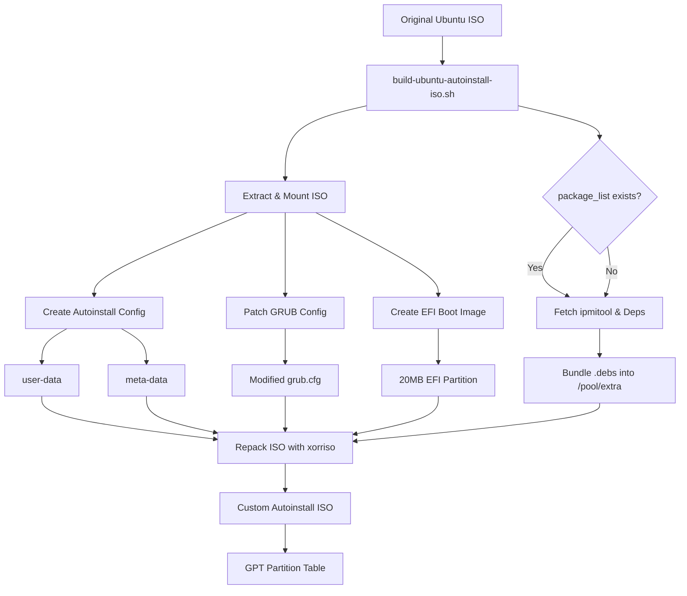
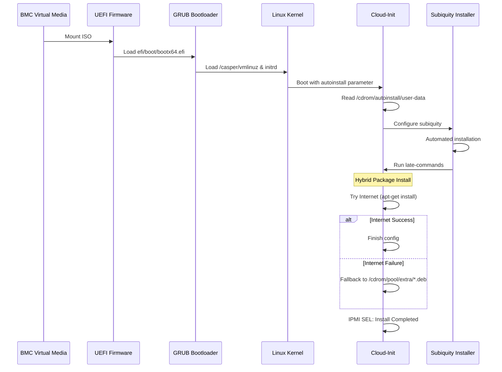
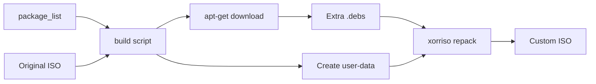

# Ubuntu Autoinstall ISO Builder - Architecture

## Overview

The Ubuntu Autoinstall ISO Builder creates a custom Ubuntu Server ISO that performs fully automated installations via BMC virtual media. The system uses cloud-init's autoinstall feature with a hybrid UEFI/BIOS bootable ISO.

## System Architecture



## Component Architecture

### 1. ISO Structure

```
Custom ISO
├── Boot Components
│   ├── MBR (Master Boot Record)
│   │   └── GRUB2 bootloader (432 bytes from isohdpfx.bin)
│   ├── GPT Partition Table
│   │   ├── Partition 1: ISO 9660 filesystem (1.8GB)
│   │   ├── Partition 2: EFI System Partition (20MB FAT32)
│   │   └── Partition 3: Boot catalog (300KB)
│   └── El Torito Boot Catalog
│       ├── BIOS boot: boot/grub/i386-pc/eltorito.img
│       └── UEFI boot: EFI partition (appended)
│
├── Main Filesystem (ISO 9660)
│   ├── /casper/
│   │   ├── vmlinuz (kernel)
│   │   └── initrd (initial ramdisk)
│   ├── /boot/grub/
│   │   ├── grub.cfg (modified with autoinstall entry)
│   ├── /autoinstall/
│   │   ├── user-data (cloud-init autoinstall config)
│   │   └── meta-data (instance metadata)
│   └── /pool/extra/
│       └── *.deb (Pre-bundled packages from package_list)
│
└── EFI System Partition (20MB FAT32)
    ├── /EFI/boot/
    │   ├── bootx64.efi (UEFI bootloader)
    │   ├── grubx64.efi (GRUB UEFI)
    │   └── mmx64.efi (MOK Manager)
    └── /boot/grub/
        ├── grub.cfg (copy of main grub.cfg)
        ├── x86_64-efi/ (GRUB modules)
        └── fonts/ (GRUB fonts)
```

### 2. Boot Flow Architecture



### 3. Data Flow



## Key Technologies

### Build Tools
- **xorriso**: ISO creation with hybrid boot support
- **mtools**: FAT filesystem manipulation for EFI partition
- **mkpasswd**: Password hashing (SHA-512)
- **ssh-keygen**: SSH key pair generation
- **apt-get download**: Isolated package fetching for target versions
- **dpkg-deb**: dependency resolution and bundling
- **jq**: JSON parsing for ISO repository metadata

### Boot Technologies
- **GRUB2**: Unified bootloader for BIOS/UEFI
- **El Torito**: CD/DVD boot standard
- **GPT**: GUID Partition Table for UEFI
- **MBR**: Master Boot Record for BIOS compatibility
- **HWE Kernel**: Automatic support for modern hardware (e.g., Sapphire Rapids)

### Installation Technologies
- **Cloud-Init**: Configuration management
- **Subiquity**: Ubuntu Server installer
- **Curtin**: Installation backend
- **Autoinstall**: Automated installation schema
- **Selective Offline Install**: Forced offline mode when `package_list` is provided
- **IPMI SEL Logging**: Automated hardware event records for install status

## Security Considerations

1. **Password Storage**: Passwords hashed with SHA-512 before embedding
2. **SSH Keys**: Unique ED25519 keys generated per build
3. **Root Access**: Enabled by default (configurable)
4. **Network Security**: No network configuration by default
5. **Package Installation**: Deferred to late-commands to prevent failures

## Scalability

- **Parallel Builds**: Script can run multiple instances with different ISOs
- **Customization**: Easy to modify user-data for different configurations
- **Version Support**: Works with Ubuntu 22.04+ Server ISOs
- **Multi-Architecture**: Supports x86_64 (amd64) architecture

## Change History

| Date | Changes | Author |
| :--- | :--- | :--- |
| 2026-03-18 | Added `package_list` support for deterministic offline package installation. | AI Assistant |
| 2026-03-17 | Implemented Hybrid (Online/Offline) package installation strategy. | AI Assistant |
| 2026-03-16 | Added support for HWE kernels and improved DNS propagation to chroot. | AI Assistant |
| 2026-02-10 | Initial architecture documentation. | AI Assistant |
