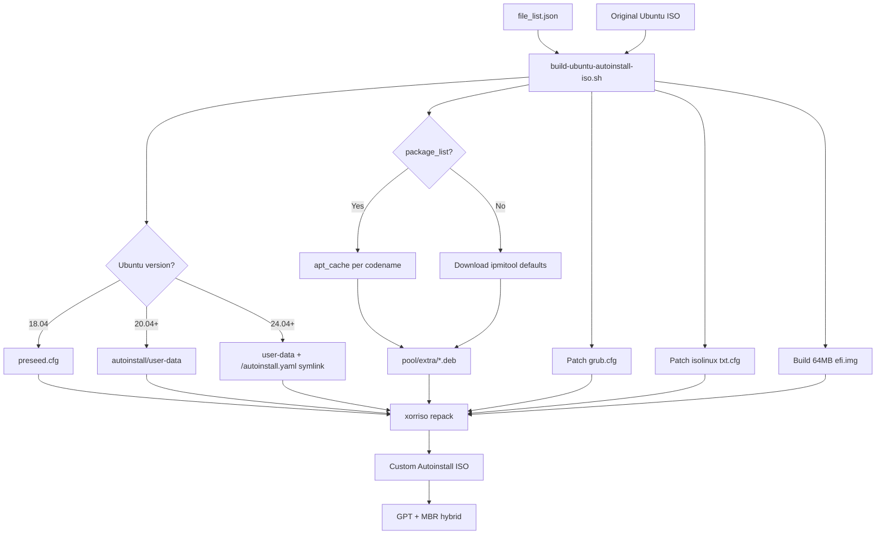

# Ubuntu Autoinstall ISO Builder - Architecture

## Overview

The Ubuntu Autoinstall ISO Builder creates custom Ubuntu Server ISOs for fully automated,
unattended installations via BMC virtual media. It supports Ubuntu 18.04 through 25.10+
with hybrid UEFI/BIOS boot and IPMI SEL telemetry for out-of-band install monitoring.

---

## Invocation

```bash
./build-ubuntu-autoinstall-iso.sh <OS_NAME> [USERNAME] [PASSWORD] [--skip-install]
```

| Argument | Required | Default | Description |
|---|---|---|---|
| `OS_NAME` | Yes | — | Lookup key in `file_list.json` (e.g. `ubuntu-24.04.2-live-server-amd64`) |
| `USERNAME` | No | `mitac` | Created user account name |
| `PASSWORD` | No | `MiTAC00123` | User + root password (SHA-512 hashed before embedding) |
| `--skip-install` | No | — | Skip host-side dependency installation |

ISO path is resolved from `iso_repository/` via `jq` lookup on `file_list.json`
(generated by `generate_file_list.py`).

---

## Multi-Version Ubuntu Support

| Ubuntu | Codename | Installer | autoinstall config | EFI Image |
|---|---|---|---|---|
| 18.04 | bionic | Preseed (d-i) | `preseed.cfg` | Original (unmodified) |
| 20.04 – 23.10 | focal … mantic | Autoinstall (subiquity) | `autoinstall/user-data` | Generated 64MB FAT32 |
| 24.04+ | noble … | Autoinstall (subiquity v4) | `autoinstall/user-data` + `/autoinstall.yaml` symlink | Generated 64MB FAT32 |

**Codename detection** (three fallback methods, in order):
1. Parse `/.disk/info` from the ISO (most reliable)
2. Inspect single subdirectory under `/dists/`
3. Version-number pattern match on `OS_NAME` string

---

## Build Phases

### Phase 0 — Dependency Validation
- Check host packages: `whois`, `xorriso`, `isolinux`, `mtools`, `jq`
- Install missing packages (idempotent via `dpkg -l` check)
- Skipped when `--skip-install` is set or not running as root

### Phase 1 — ISO Lookup & Extraction
- `lookup_iso_path()` queries `file_list.json` via `jq`
- Mount original ISO read-only at `/mnt/ubuntuiso`
- `rsync -a` copy to isolated `workdir_custom_iso/${BUILD_ID}/`
- Detect Ubuntu codename (fallback chain above)

### Phase 2 — Package Bundling (20.04+ only)
See [Package Bundling Strategy](#package-bundling-strategy) below.

### Phase 3 — Configuration Generation
- Hash password: `mkpasswd -m sha-512`
- Generate SSH ed25519 key pair with timestamp+random suffix
- Write `autoinstall/user-data` (cloud-init YAML)
- Write `autoinstall/meta-data` (empty instance metadata)
- **18.04 only:** write `preseed.cfg`
- **24.04+ only:** create symlink `/autoinstall.yaml → /cdrom/autoinstall/user-data`
  (required because subiquity v4 reads this path before processing other configs)

### Phase 4 — Boot Configuration Patching
- **GRUB (`/boot/grub/grub.cfg`):** replace menuentry kernel args with autoinstall parameters;
  set timeout to 5 s
- **ISOLINUX (`isolinux/txt.cfg`, `isolinux/adtxt.cfg`):** patch `append` lines with
  autoinstall parameters; set `prompt 0`, timeout 10 s
- Kernel parameters added: `autoinstall ds=nocloud;s=/cdrom/autoinstall/ boot=casper`

### Phase 5 — EFI Boot Image Creation (20.04+ only)
- Create 64 MB FAT32 image at `/tmp/efi.img`
- Populate `/EFI/BOOT/` with `bootx64.efi`, `grubx64.efi`, `mmx64.efi`
- Copy patched `grub.cfg` and full GRUB module tree (`x86_64-efi/`, `fonts/`)
- Copy `startup.nsh` to image root (UEFI Shell auto-execution)

### Phase 6 — ISO Rebuild (xorriso)
- Extract MBR from original ISO or fall back to `/usr/lib/ISOLINUX/isohdpfx.bin`
- **18.04:** xorriso with `isohybrid-mbr` + BIOS/EFI alternate-boot entries
- **20.04+:** xorriso with `--grub2-mbr` + GPT EFI partition appended; output to
  `output_custom_iso/${BUILD_ID}/`

### Phase 7 — Cleanup
- `trap cleanup EXIT` removes `workdir_custom_iso/${BUILD_ID}/`
- Output ISO in `output_custom_iso/${BUILD_ID}/` is retained
- Echo final ISO path to stdout (parsed by calling code)

---

## System Architecture Diagram



---

## ISO Structure

```
ISO Root
├── .disk/info                          Ubuntu release metadata
├── autoinstall.yaml -> /cdrom/autoinstall/user-data  (24.04+ symlink)
├── autoinstall/
│   ├── user-data                       cloud-init autoinstall YAML
│   ├── meta-data                       empty instance metadata
│   ├── scripts/
│   │   └── find_disk.sh                empty-disk detection + serial patching
│   ├── docker.asc                      Docker GPG key (if docker in package_list)
│   └── kubernetes.gpg                  Kubernetes GPG key (if kube* in package_list)
├── boot/
│   └── grub/
│       ├── grub.cfg                    PATCHED: autoinstall kernel args, 5s timeout
│       ├── x86_64-efi/                 GRUB EFI modules
│       └── fonts/                      GRUB fonts (unicode.pf2)
├── casper/                             Ubuntu 20.04+ live filesystem
│   ├── vmlinuz
│   └── initrd
├── install/                            Ubuntu 18.04 installer (bionic)
│   ├── vmlinuz
│   └── initrd.gz
├── EFI/                                UEFI boot code (from original ISO)
├── isolinux/
│   ├── isolinux.bin                    BIOS bootloader
│   ├── txt.cfg                         PATCHED: autoinstall append, prompt=0
│   └── adtxt.cfg                       PATCHED: advanced BIOS boot
├── pool/extra/
│   ├── *.deb                           bundled packages (ipmitool, docker-ce, kubelet …)
│   └── ipmi_start_logger.py            binary-less IPMI SEL logging utility
└── preseed.cfg                         18.04 only

EFI System Partition (appended, 64 MB FAT32, 20.04+ only)
├── startup.nsh                         UEFI Shell auto-boot script
└── EFI/BOOT/
    ├── bootx64.efi
    ├── grubx64.efi
    ├── mmx64.efi
    └── grub.cfg                        copy of patched grub.cfg
```

---

## Boot Chain

### UEFI Boot (20.04+)

```
Firmware
  └── GPT partition 2 (appended EFI image)
        └── EFI/BOOT/bootx64.efi
              └── startup.nsh            searches fs0:–fs39: for grub.cfg
                    └── EFI/BOOT/grubx64.efi
                          └── patched grub.cfg
                                └── casper/vmlinuz + initrd
                                      autoinstall ds=nocloud;s=/cdrom/autoinstall/
                                        └── cloud-init reads autoinstall/user-data
                                              └── Subiquity performs installation
```

### UEFI Boot (18.04)
- Original `efi.img` is **not** modified
- Embedded grub script inside the image:
  1. `search --file --set=root /.disk/info` (locates ISO9660 filesystem)
  2. `configfile /boot/grub/grub.cfg` (loads patched config from ISO root)
- Patched `/boot/grub/grub.cfg` on the ISO9660 layer is sufficient

### BIOS/Legacy Boot (All Versions)

```
Firmware
  └── MBR (isohdpfx.bin)
        └── isolinux.bin
              └── patched txt.cfg / adtxt.cfg
                    └── vmlinuz + initrd
                          boot=casper autoinstall ds=nocloud;s=/cdrom/autoinstall/
```

---

## user-data Structure

```yaml
autoinstall:
  version: 1

  identity:
    hostname: ubuntu-auto
    username: <USERNAME>
    password: <SHA-512 hash>

  locale: en_US.UTF-8
  keyboard: { layout: us }

  ssh:
    install-server: true
    authorized-keys: [ <generated ed25519 public key> ]
    allow-pw: true

  storage:
    config:
      - type: disk
        match: { serial: __ID_SERIAL__ }   # patched at runtime by find_disk.sh
        ptable: gpt
        wipe: superblock-recursive
      - type: partition  # 512 MB EFI partition (c12a7328-… GUID)
      - type: partition  # root (remaining space)
      - type: format (vfat / ext4)
      - type: mount (/ and /boot/efi)

  updates: security
  refresh-installer: { update: no }

  apt:
    fallback: offline-install
    geoip: false

  early-commands:
    - systemctl stop multipathd          # prevent curtin ABI mismatch (25.04+)
    - modprobe ipmi_devintf ipmi_si ipmi_msghandler
    - python3 /cdrom/pool/extra/ipmi_start_logger.py 0x0F   # Pre-install Start
    - sh /cdrom/autoinstall/scripts/find_disk.sh             # detect disk serial
    - dpkg -i /cdrom/pool/extra/*.deb                        # offline ipmitool
    - python3 … 0x1F   # Pre-install Complete
    - python3 … 0x01   # OS Installation Start

  late-commands:
    - python3 … 0x06                     # Post-Install Start
    - set root password (chpasswd)
    - patch /etc/ssh/sshd_config (PermitRootLogin, PasswordAuthentication)
    - write /etc/sudoers.d/<USERNAME>
    - install packages (offline dpkg or online apt)
    - set up Docker / Kubernetes repos and GPG keys (if requested)
    - python3 … 0x16                     # Post-Install Complete
    - log IP address to SEL (0x03 + 0x13)
    - verify disk serial → audit log → SEL 0x05 0x4f/0x45
    - python3 … 0xAA                     # OS Installation Completed

  error-commands:
    - log IP to SEL (0x03 + 0x13)
    - python3 … 0xEE                     # ABORTED / FAILED
```

---

## Package Bundling Strategy

Three strategies depending on the presence of `package_list`:

| Strategy | Trigger | Method |
|---|---|---|
| **Offline** | `package_list` file present | Resolve full dependency closure; download to `apt_cache/<codename>/`; bundle into `pool/extra/`; install via `dpkg -i` in late-command |
| **Hybrid** | No `package_list` | Attempt online `apt-get install` in late-command; fall back to `pool/extra/*.deb` on failure |
| **Mandatory** | Always (20.04+) | Download `ipmitool`, `grub-efi-amd64-signed`, `shim-signed`, `efibootmgr` for early-command SEL logging |

**APT cache structure** (`apt_cache/` — persistent across builds):
```
apt_cache/
├── noble/
│   └── archives/
│       ├── ipmitool_1.8.18-12ubuntu1_amd64.deb
│       ├── docker-ce_27.x_amd64.deb
│       └── …
├── jammy/
├── focal/
└── …
```

Deduplication: before downloading any package, check `apt_cache/<codename>/archives/${pkg}_*.deb`.
Skips re-download if any version already cached.

**Isolated APT environment** (prevents host-version interference):
- Temporary `dpkg` status file (empty) → resolves dependencies for target version, not host
- Separate `sources.list` pointing to the target Ubuntu codename repos
- GPG keys copied from host `/etc/apt/`

---

## IPMI SEL Telemetry

### Binary-less Logger (`ipmi_start_logger.py`)
- Sends raw IPMI commands via `/dev/ipmi0` (ioctl — no `ipmitool` binary needed at boot time)
- Tries two channels (0x00, 0x0f) × two ioctl codes for robustness
- Lock file per marker: `/tmp/ipmi_marker_0xXX.lock` prevents duplicate SEL entries
  if early-commands or late-commands execute more than once (subiquity restart bug)

### Marker Table

| Marker | Hex | Phase | byte1 | byte2 | Meaning |
|---|---|---|---|---|---|
| Package Pre-install Start | `0x0F` | early-cmd | — | — | Before `dpkg -i` |
| Package Pre-install Complete | `0x1F` | early-cmd | — | — | After `dpkg -i` |
| OS Installation Start | `0x01` | early-cmd | — | — | Disk detected, install begins |
| IP (octets 1–2) | `0x03` | late/error | octet1 | octet2 | Split IP logging |
| IP (octets 3–4) | `0x13` | late/error | octet3 | octet4 | Split IP logging |
| Post-Install Start | `0x06` | late-cmd | — | — | Before SSH/sudoers config |
| Post-Install Complete | `0x16` | late-cmd | — | — | After package install |
| Disk Verify OK | `0x05` | late-cmd | `0x4f` ('O') | `0x4b` ('K') | Serial matched |
| Disk Verify Fail | `0x05` | late-cmd | `0x45` ('E') | `0x52` ('R') | Serial mismatch |
| OS Installation Completed | `0xAA` | late-cmd | — | — | Final success marker |
| ABORTED / FAILED | `0xEE` | error-cmd | — | — | Install failed |

Telemetry also written to `/var/log/ipmi_telemetry.log` and copied to target at completion.

---

## Disk Detection (`scripts/find_disk.sh`)

Runs in `early-commands` before partitioning:

1. Enumerate block devices: `lsblk -nd -o NAME --exclude 1,2,11`
2. Filter empty disks (all three must be true):
   - Zero partitions (`lsblk -n -o TYPE | grep -c part` == 0)
   - No filesystem signatures (`wipefs --probe` returns nothing)
   - No data in first 1 MB (`dd | tr -d '\0' | wc -c` == 0)
3. Select the **smallest** empty disk (avoids large data drives)
4. Extract serial: `udevadm info --query=property` → `ID_SERIAL`
   (NVMe fallback: `/sys${DEVPATH}/../serial`)
5. Patch config: `sed -i "s/__ID_SERIAL__/${serial}/g"` on
   `/autoinstall.yaml`, `/run/subiquity/*.yaml`, `/tmp/autoinstall.yaml`

---

## UEFI Shell Boot (`startup.nsh`)

Placed at the root of the EFI image. Some BMC/UEFI implementations require an explicit
shell script rather than directly executing `bootx64.efi` from an appended partition.

Logic: iterate `fs0:` – `fs39:`, search for `startup.nsh`, then locate and launch
`EFI/BOOT/grub.cfg` / `bootx64.efi`. Provides graceful multi-filesystem fallback.

---

## Build Isolation

```
workdir_custom_iso/${BUILD_ID}/    ← deleted on exit (trap cleanup EXIT)
output_custom_iso/${BUILD_ID}/     ← kept (contains final ISO)
apt_cache/                         ← shared, persistent across builds
iso_repository/                    ← input ISOs (read-only)
```

`BUILD_ID = $(date +%Y%m%d%H%M%S)_$(mktemp -u XXXX)` — safe for parallel execution.
All internal paths use absolute references so `xorriso` subshell `cd` does not break them.

---

## Security

| Feature | Implementation |
|---|---|
| Password hashing | `mkpasswd -m sha-512` before embedding in user-data |
| SSH keys | Ed25519, unique per build, timestamped name |
| Root login | Enabled via sshd_config in late-command |
| Sudo | `NOPASSWD:ALL` written to `/etc/sudoers.d/<USERNAME>` |
| Package repo integrity | Docker + Kubernetes GPG keys bundled and applied with `signed-by` |
| Disk audit | Serial comparison after install; result logged + reported to IPMI SEL |

---

## Key Technologies

| Category | Tools |
|---|---|
| **Build** | bash, xorriso, mtools, mkpasswd, ssh-keygen, jq, rsync |
| **ISO Boot** | GRUB2, El Torito, GPT/MBR hybrid, ISOLINUX, UEFI Shell (startup.nsh) |
| **Installation** | cloud-init, Subiquity (20.04+), Preseed/d-i (18.04), curtin |
| **Telemetry** | IPMI SEL via `/dev/ipmi0` ioctl (binary-less Python) |
| **Package cache** | apt_cache per codename, isolated dpkg status environment |

---

## Version Comparison Summary

The table below consolidates every behaviour difference across the three supported Ubuntu
generation paths. Use it as a quick reference when adding support for a new release or
debugging a version-specific failure.

| Aspect | 18.04 (bionic) | 20.04 – 23.10 (focal … mantic) | 24.04+ (noble …) |
|---|---|---|---|
| **Installer engine** | Preseed / Debian Installer (d-i) | Autoinstall (Subiquity) | Autoinstall (Subiquity v4) |
| **Autoinstall config** | `preseed.cfg` in ISO root | `autoinstall/user-data` | `autoinstall/user-data` + `/autoinstall.yaml` symlink |
| **Why symlink needed (24.04+)** | — | — | Subiquity v4 reads `/autoinstall.yaml` before processing other configs; symlink must exist before early-commands run |
| **Boot path — UEFI** | Alt-boot via original unmodified `efi.img`; grub reads `/boot/grub/grub.cfg` from ISO9660 | GPT partition 2 (generated 64 MB FAT32); `startup.nsh` → `bootx64.efi` → patched `grub.cfg` | Same as 20.04–23.10 |
| **Boot path — BIOS** | ISOLINUX → patched `txt.cfg` / `adtxt.cfg` | Same | Same |
| **EFI image** | Original `efi.img` retained unmodified | New 64 MB FAT32 image generated | New 64 MB FAT32 image generated |
| **grub.cfg patched** | Yes (ISO9660 layer only) | Yes (ISO9660 + inside EFI image) | Yes (ISO9660 + inside EFI image) |
| **isolinux patched** | Yes (`txt.cfg`, `adtxt.cfg`) | Yes | Yes |
| **Kernel/initrd path** | `install/vmlinuz` + `install/initrd.gz` | `casper/vmlinuz` + `casper/initrd` | `casper/vmlinuz` + `casper/initrd` |
| **`multipathd` stopped** | Not applicable | Not applicable | Yes — `systemctl stop multipathd` in early-commands (curtin ABI mismatch on 25.04+) |
| **Disk detection** | Not implemented (manual input) | `find_disk.sh` patches `__ID_SERIAL__` before Subiquity reads config | `find_disk.sh` patches `__ID_SERIAL__` before Subiquity reads config |
| **Package bundling** | Preseed `d-i` downloads (not pool/extra) | `pool/extra/*.deb` (offline or hybrid) | `pool/extra/*.deb` (offline or hybrid) |
| **apt_cache used** | No | Yes — per-codename persistent cache | Yes — per-codename persistent cache |
| **IPMI SEL logging** | Not implemented | Binary-less Python (`ipmi_start_logger.py`) via `/dev/ipmi0` ioctl | Binary-less Python (`ipmi_start_logger.py`) via `/dev/ipmi0` ioctl |
| **IPMI dedup lock** | Not applicable | `/tmp/ipmi_marker_0xXX.lock` per marker | `/tmp/ipmi_marker_0xXX.lock` per marker |
| **`startup.nsh`** | Not included | Included in EFI image root | Included in EFI image root |
| **xorriso MBR mode** | `isohybrid-mbr` + BIOS/EFI alternate-boot | `--grub2-mbr` + appended GPT EFI partition | `--grub2-mbr` + appended GPT EFI partition |
| **`autoinstall ds=` parameter** | `preseed/url` (d-i syntax) | `ds=nocloud;s=/cdrom/autoinstall/` | `ds=nocloud;s=/cdrom/autoinstall/` |
| **SSH key injection** | Via preseed `d-i passwd` | `authorized-keys` in user-data | `authorized-keys` in user-data |
| **Root password set** | Via preseed | `chpasswd` in late-command | `chpasswd` in late-command |
| **Docker / Kubernetes repo** | Not supported | GPG key bundled; repo added in late-command | GPG key bundled; repo added in late-command |

---

## Change History

| Date | Changes |
|---|---|
| 2026-04-01 | Full rewrite to reflect current code: multi-version support, phases, IPMI markers, find_disk.sh, startup.nsh, apt_cache, build isolation |
| 2026-03-18 | Added `package_list` offline bundling strategy |
| 2026-03-17 | Hybrid online/offline package installation |
| 2026-03-16 | HWE kernel support, DNS propagation to chroot |
| 2026-02-10 | Initial architecture documentation |
