# Ubuntu Autoinstall ISO Builder - Workflow

## Build Process Flow

```mermaid
flowchart TD
    Start([Start Script]) --> CheckArgs{Arguments valid?}
    CheckArgs -->|No| ShowHelp[Show help & exit]
    CheckArgs -->|Yes| InstallDeps[Phase 0: Install host dependencies]

    InstallDeps --> LookupISO[Phase 1: Lookup ISO path from file_list.json]
    LookupISO --> MountISO[Mount original ISO read-only]
    MountISO --> CopyISO[rsync ISO contents to workdir BUILD_ID]
    CopyISO --> DetectVer[Detect Ubuntu codename\n.disk/info → /dists/ → version pattern]

    DetectVer --> Ver18{18.04?}
    Ver18 -->|Yes| Skip18[Skip package bundling]
    Ver18 -->|No| Phase2[Phase 2: Package bundling]

    Phase2 --> PkgList{package_list\nexists?}
    PkgList -->|Yes| OfflinePkg[Resolve full dep closure\ndownload to apt_cache/codename/]
    PkgList -->|No| DefaultPkg[Download ipmitool defaults]
    OfflinePkg --> BundlePkg[Copy .debs to pool/extra/]
    DefaultPkg --> BundlePkg

    BundlePkg --> Phase3[Phase 3: Configuration generation]
    Skip18 --> Phase3

    Phase3 --> HashPW[Hash password: mkpasswd -m sha-512]
    HashPW --> GenSSH[Generate ed25519 SSH key pair]
    GenSSH --> WriteUD[Write autoinstall/user-data]
    WriteUD --> WriteMD[Write autoinstall/meta-data]
    WriteMD --> Ver18b{18.04?}
    Ver18b -->|Yes| WritePreseed[Write preseed.cfg]
    Ver18b -->|No| Ver24{24.04+?}
    Ver24 -->|Yes| WriteSymlink[Create /autoinstall.yaml symlink]
    Ver24 -->|No| Phase4

    WritePreseed --> Phase4[Phase 4: Boot config patching]
    WriteSymlink --> Phase4

    Phase4 --> PatchGRUB[Patch boot/grub/grub.cfg\nautoinstall args, timeout=5s]
    PatchGRUB --> PatchISO[Patch isolinux txt.cfg / adtxt.cfg\nautoinstall args, prompt=0]
    PatchISO --> Ver18c{18.04?}
    Ver18c -->|Yes| SkipEFI[Skip EFI image generation]
    Ver18c -->|No| Phase5[Phase 5: Build 64MB FAT32 EFI image]

    Phase5 --> PopEFI[Populate EFI/BOOT/ bootloaders\nGRUB modules, fonts, grub.cfg]
    PopEFI --> CopyNSH[Copy startup.nsh to EFI root]

    SkipEFI --> Phase6[Phase 6: Rebuild ISO with xorriso]
    CopyNSH --> Phase6

    Phase6 --> Ver18d{18.04?}
    Ver18d -->|Yes| Xorr18[xorriso: isohybrid-mbr\nBIOS + EFI alt-boot]
    Ver18d -->|No| Xorr20[xorriso: grub2-mbr\nappended GPT EFI partition]

    Xorr18 --> Cleanup[Phase 7: Remove workdir\nkeep output_custom_iso/BUILD_ID/]
    Xorr20 --> Cleanup
    Cleanup --> Done([ISO created successfully])
```



---

## Build Phase Details

### Phase 0 — Host Dependency Check

1. Verify required packages: `whois`, `xorriso`, `isolinux`, `mtools`, `jq`
2. Install any missing packages (idempotent via `dpkg -l`)
3. Skip if `--skip-install` passed or not running as root

### Phase 1 — ISO Lookup & Extraction

1. Call `lookup_iso_path()`: query `file_list.json` via `jq` for `OS_Name` match
2. Resolve full path: `iso_repository/<OS_Path>`
3. Mount original ISO read-only at `/mnt/ubuntuiso`
4. `rsync -a` full ISO contents to `workdir_custom_iso/${BUILD_ID}/`
5. Detect Ubuntu codename (three fallback methods in order):
   - Parse `/.disk/info` (e.g. `"Jammy Jellyfish"` → `jammy`)
   - Inspect single subdirectory under `/dists/`
   - Pattern-match version number in `OS_NAME` string

### Phase 2 — Package Bundling (20.04+ only)

1. Create isolated APT environment:
   - Empty `dpkg` status file (prevents host-version interference)
   - `sources.list` pointing to target codename repos
   - GPG keys copied from host `/etc/apt/`
2. Resolve full dependency closure via `apt-get -s install --reinstall`
3. For each package in `package_list` (or defaults: ipmitool, grub-efi, shim, efibootmgr):
   - Check `apt_cache/<codename>/archives/${pkg}_*.deb` — skip if already cached
   - Otherwise download to `apt_cache/<codename>/archives/`
4. Copy cached `.deb` files to `workdir/pool/extra/`
5. Bundle `ipmi_start_logger.py` into `pool/extra/`
6. If `docker` in `package_list`: download `docker.asc` GPG key
7. If `kube*` in `package_list`: download `kubernetes.gpg` key
8. Copy `scripts/find_disk.sh` to `workdir/autoinstall/scripts/`

### Phase 3 — Configuration Generation

1. Hash password: `mkpasswd -m sha-512 ${PASSWORD}`
2. Generate SSH ed25519 key pair named `id_ed25519_<YYYYMMDD_HHMMSS>_<4-char-random>`
3. Write `autoinstall/user-data` (cloud-init YAML, see [user-data structure](#user-data-structure))
4. Write `autoinstall/meta-data` (empty file, required by cloud-init)
5. **18.04 only:** write `preseed.cfg` in ISO root
6. **24.04+ only:** create symlink `/autoinstall.yaml → /cdrom/autoinstall/user-data`
   (Subiquity v4 reads this path before processing other configs)

### Phase 4 — Boot Configuration Patching

1. **GRUB** (`boot/grub/grub.cfg`):
   - Replace menuentry kernel args with autoinstall parameters
   - Add: `autoinstall ds=nocloud;s=/cdrom/autoinstall/ boot=casper`
   - Set `timeout=5`
2. **ISOLINUX** (`isolinux/txt.cfg`, `isolinux/adtxt.cfg`):
   - Patch `append` lines with autoinstall parameters
   - Set `prompt 0`, `timeout 100` (10 s in isolinux units)

### Phase 5 — EFI Boot Image (20.04+ only)

1. Create 64 MB FAT32 image at `/tmp/efi.img`
2. Populate `/EFI/BOOT/` with `bootx64.efi`, `grubx64.efi`, `mmx64.efi`
3. Copy patched `grub.cfg` into `/EFI/BOOT/` and `/boot/grub/`
4. Copy full GRUB module tree (`x86_64-efi/`) and `fonts/`
5. Copy `startup.nsh` to image root (UEFI Shell auto-execution)

### Phase 6 — ISO Rebuild

| Version | xorriso flags | Result |
|---|---|---|
| 18.04 | `isohybrid-mbr` + BIOS/EFI `alt-boot` | Hybrid BIOS/UEFI via original efi.img |
| 20.04+ | `--grub2-mbr` + appended GPT EFI partition | GPT hybrid with new 64 MB EFI image |

Output: `output_custom_iso/${BUILD_ID}/<name>_autoinstall_<YYYYMMDDHHMM>.iso`

### Phase 7 — Cleanup

- `trap cleanup EXIT` fires on normal exit, error, or signal
- Removes `workdir_custom_iso/${BUILD_ID}/` (temporary build artifacts)
- Retains `output_custom_iso/${BUILD_ID}/` (final ISO)
- Prints ISO absolute path to stdout (parsed by calling code in `main.py`)

---

## Installation Workflow (Runtime)

```mermaid
flowchart TD
    Boot([Boot from ISO via BMC virtual media]) --> UEFIorBIOS{UEFI or BIOS?}

    UEFIorBIOS -->|UEFI| UEFI20{Version?}
    UEFI20 -->|18.04| UEFI18[efi.img grub reads\n/boot/grub/grub.cfg from ISO9660]
    UEFI20 -->|20.04+| UEFI20p[startup.nsh searches fs0-fs39\nbootx64.efi → patched grub.cfg]

    UEFIorBIOS -->|BIOS| BIOS[isolinux → patched txt.cfg]

    UEFI18 --> KernelBoot
    UEFI20p --> KernelBoot
    BIOS --> KernelBoot

    KernelBoot[Kernel boots\nds=nocloud;s=/cdrom/autoinstall/] --> EarlyCmd[early-commands]

    EarlyCmd --> StopMpath[Stop multipathd\n25.04+ ABI fix]
    StopMpath --> ModprobeIPMI[modprobe ipmi_devintf\nipmi_si ipmi_msghandler]
    ModprobeIPMI --> SEL0F[IPMI SEL 0x0F\nPackage Pre-install Start]
    SEL0F --> FindDisk[find_disk.sh\nDetect smallest empty disk\nPatch __ID_SERIAL__]
    FindDisk --> DpkgIPMI[dpkg -i pool/extra/*.deb\nInstall ipmitool offline]
    DpkgIPMI --> SEL1F[IPMI SEL 0x1F\nPackage Pre-install Complete]
    SEL1F --> SEL01[IPMI SEL 0x01\nOS Installation Start]

    SEL01 --> Subiquity[Subiquity reads user-data\nPartition disk by serial\nInstall base system]

    Subiquity -->|Success| LateCmd[late-commands]
    Subiquity -->|Failure| ErrCmd[error-commands]

    LateCmd --> SEL06[IPMI SEL 0x06\nPost-Install Start]
    SEL06 --> SetRoot[Set root password\nchpasswd]
    SetRoot --> PatchSSH[Patch sshd_config\nPermitRootLogin + PasswordAuthentication]
    PatchSSH --> Sudoers[Write sudoers.d/USERNAME\nNOPASSWD:ALL]
    Sudoers --> PkgMode{package_list\nprovided?}

    PkgMode -->|Yes - Offline| CopyDebs[Copy pool/extra/*.deb to target\ndpkg -i]
    PkgMode -->|No - Hybrid| TryOnline[apt-get update && install]
    TryOnline -->|Success| AfterPkg
    TryOnline -->|Fail| CopyDebs
    CopyDebs --> AfterPkg

    AfterPkg --> DockerKube{Docker/Kube\nin package_list?}
    DockerKube -->|Yes| RepoSetup[Add Docker/Kubernetes repos\nApply GPG keys\nInstall packages]
    DockerKube -->|No| SEL16

    RepoSetup --> SEL16[IPMI SEL 0x16\nPost-Install Complete]
    SEL16 --> LogIP[Log IP to SEL\n0x03 octet1+2\n0x13 octet3+4]
    LogIP --> DiskAudit{Disk serial\nmatches?}
    DiskAudit -->|Yes| SEL05OK[IPMI SEL 0x05 0x4f 0x4b\nDisk Verify OK]
    DiskAudit -->|No| SEL05ER[IPMI SEL 0x05 0x45 0x52\nDisk Verify FAIL]
    SEL05OK --> SELAA[IPMI SEL 0xAA\nOS Installation Completed]
    SEL05ER --> SELAA
    SELAA --> CopyLog[Copy ipmi_telemetry.log to target]
    CopyLog --> Done([Installation complete / reboot])

    ErrCmd --> ErrIP[Log IP to SEL\n0x03 + 0x13]
    ErrIP --> SELEE[IPMI SEL 0xEE\nABORTED / FAILED]
    SELEE --> Halt([Installer halted])
```



---

## user-data Structure

```yaml
autoinstall:
  version: 1

  identity:
    hostname: ubuntu-auto
    username: <USERNAME>
    password: <SHA-512 hash>

  locale: en_US.UTF-8
  keyboard: { layout: us }

  ssh:
    install-server: true
    authorized-keys: [ <generated ed25519 public key> ]
    allow-pw: true

  storage:                             # GPT layout, target disk matched by serial
    config:
      - type: disk
        match: { serial: __ID_SERIAL__ }   # patched at runtime by find_disk.sh
        ptable: gpt
        wipe: superblock-recursive
      - type: partition   # 512 MB EFI  (GUID c12a7328-…)
      - type: partition   # root        (remaining space)
      - type: format      # vfat (EFI), ext4 (root)
      - type: mount       # /boot/efi, /

  updates: security                    # security patches only; no full upgrade
  refresh-installer: { update: no }

  apt:
    fallback: offline-install          # use pool/extra if online fails
    geoip: false

  early-commands:   [ see runtime flow above ]
  late-commands:    [ see runtime flow above ]
  error-commands:   [ see runtime flow above ]
```

---

## Disk Serial Detection (`find_disk.sh`)

Runs inside `early-commands` before Subiquity partitions the disk:

```
lsblk enumerate all block devices (exclude RAM/loop)
  └─ for each device:
       ├─ partitions?    lsblk -n -o TYPE | grep -c part  == 0   → skip if occupied
       ├─ filesystem?    wipefs --probe                           → skip if signed
       └─ data present?  dd first 1MB | tr -d '\0' | wc -c == 0 → skip if non-zero

select smallest empty disk by size

extract serial:
  udevadm info --query=property → ID_SERIAL
  NVMe fallback: /sys${DEVPATH}/../serial

patch:
  sed -i "s/__ID_SERIAL__/${serial}/g" /autoinstall.yaml
                                        /run/subiquity/*.yaml
                                        /tmp/autoinstall.yaml
```

---

## IPMI SEL Marker Sequence

```
early-commands ──► 0x0F  Package Pre-install Start
                   0x1F  Package Pre-install Complete
                   0x01  OS Installation Start

late-commands  ──► 0x06  Post-Install Start
                   0x16  Post-Install Complete
                   0x03  IP octets 1–2
                   0x13  IP octets 3–4
                   0x05  Disk Verify (0x4f/0x4b = OK, 0x45/0x52 = ERR)
                   0xAA  OS Installation Completed

error-commands ──► 0x03  IP octets 1–2
                   0x13  IP octets 3–4
                   0xEE  ABORTED / FAILED
```

Each marker is guarded by a lock file `/tmp/ipmi_marker_0xXX.lock` to prevent
duplicate SEL entries if commands run more than once (Subiquity restart bug).

---

## Change History

| Date | Changes |
|---|---|
| 2026-04-01 | Full rewrite: accurate 7-phase build flow, UEFI/BIOS/18.04 runtime paths, IPMI SEL sequence, find_disk.sh logic, Docker/Kubernetes repo steps, error-command path |
| 2026-03-18 | Added `package_list` detection and isolated APT bundling workflow |
| 2026-03-17 | Added Hybrid installation runtime logic and DNS propagation fix |
| 2026-03-16 | Updated boot flow for 24.04 compatibility and HWE kernel support |
| 2026-02-10 | Initial workflow documentation |

---

## 2026-04-01 Update Summary

| Section | Before | After |
|---|---|---|
| **Build flow diagram** | Single flat flowchart; no version branching; incorrect step order (package bundling before ISO mount); missing ISOLINUX patching, startup.nsh, cleanup trap | Accurate 7-phase flowchart with 18.04 vs 20.04+ vs 24.04+ branches at every decision point |
| **Build phases** | 5 phases with vague descriptions | 7 numbered phases with concrete step-by-step actions |
| **Phase 0** | Not present (deps bundled inside Phase 1) | Explicit dependency check phase with idempotency note |
| **Phase 1 — ISO extraction** | States "Clean Work & Output Directories" (wrong — script uses fresh BUILD_ID, no cleaning) | Correct: creates new isolated `workdir_custom_iso/${BUILD_ID}/` per run |
| **Phase 2 — Package bundling** | Describes `apt-cache depends` (not what the script uses) | Correct: `apt-get -s install --reinstall` for dependency closure; per-codename cache dedup |
| **Phase 3 — Config generation** | Missing 24.04+ symlink; missing preseed.cfg for 18.04 | Both paths documented; symlink necessity explained |
| **Phase 4 — Boot patching** | States `timeout=0` (wrong) | Correct: `timeout=5` for GRUB, `timeout 100` for ISOLINUX; ISOLINUX patching now included |
| **Phase 5 — EFI image** | States 20 MB FAT32 | Correct: 64 MB FAT32; startup.nsh inclusion documented |
| **Phase 6 — ISO rebuild** | Generic xorriso description | Version-specific flag table: isohybrid-mbr (18.04) vs grub2-mbr + GPT (20.04+) |
| **Phase 7 — Cleanup** | Not present | Documented: trap cleanup EXIT, workdir removed, output kept, path echoed to stdout |
| **Runtime flow diagram** | Single path; missing multipathd stop, find_disk.sh, full IPMI SEL sequence, Docker/Kubernetes step, disk audit, error-commands path | Full two-branch flow: success path (late-commands) and failure path (error-commands) with all IPMI markers |
| **IPMI SEL sequence** | Not present | Complete ordered sequence with hex codes and lock-file dedup |
| **find_disk.sh** | Not present | Full detection algorithm documented |
| **user-data structure** | Not present | Annotated YAML outline |
| **Error handling** | Two bullet points about DNS and HWE kernel | Full error-commands flow with IP logging and 0xEE abort marker |
