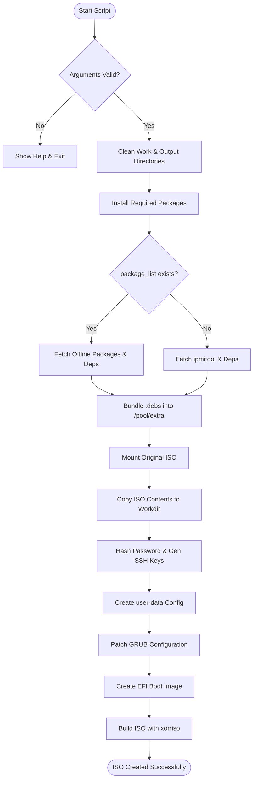
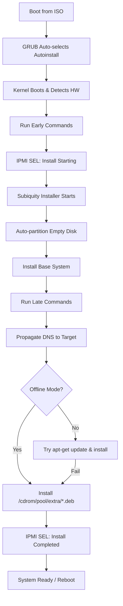

# Ubuntu Autoinstall ISO Builder - Workflow

## Build Process Flow

## Detailed Step-by-Step Workflow

### Phase 1: Initialization & Validation

**Steps:**
1. Parse command-line arguments (ISO name, username, password).
2. Detect if `package_list` exists in the script directory.
3. Validate and install host build dependencies (`xorriso`, `mtools`, `jq`, etc.).
4. Use `file_list.json` to lookup the source ISO path.

### Phase 2: Package Bundling (New)

**Steps:**
1. Create an isolated temporary APT environment (cache, state, sources).
2. Detect target Ubuntu version from source ISO name (e.g., Jammy, Noble).
3. Generate a version-matched `sources.list` for the target codename.
4. Use `apt-get download` to fetch packages listed in `package_list` (or default `ipmitool`).
5. Resolve dependencies using `apt-cache depends` and download them into a local storage.
6. Prepare the `/pool/extra` directory in the build workspace.

### Phase 3: ISO Extraction & Customization

**Steps:**
1. Mount source ISO and `rsync` contents to the build directory.
2. Add autoinstall configuration (`user-data`, `meta-data`).
3. **Dynamic User-Data Generation**:
   - If `package_list` was used, configure the installer for **Strict Offline Mode**.
   - Otherwise, configure for **Hybrid Mode** (Internet primary, CDROM fallback).
4. Patch `boot/grub/grub.cfg` to set `timeout=0` and add the `autoinstall` kernel parameter.

### Phase 4: Boot Infrastructure

**Steps:**
1. Extract MBR from the original ISO for legacy compatibility.
2. Create a 20MB FAT32 EFI partition image.
3. Populate EFI image with GRUB bootloaders, modules, and the custom `grub.cfg`.

### Phase 5: ISO Assembly

**Steps:**
1. Use `xorriso` to combine the filesystem, boot catalog, and EFI partition.
2. Create a hybrid bootable ISO with GPT and MBR support.
3. Write the final image to the `output_custom_iso/` directory.

## Installation Workflow (Runtime)

## Error Handling Flow

**Optimizations:**
- **DNS Isolation**: The script now handles DNS resolution inside `chroot` by resolving the stub resolver (`127.0.0.53`) to actual nameservers for the target.
- **Kernel Mismatch**: Handles HWE kernels (6.8+) for modern platforms like Sapphire Rapids by ensuring correct package naming in `user-data`.

## Change History

| Date | Changes | Author |
| :--- | :--- | :--- |
| 2026-03-18 | Integrated `package_list` detection and isolated APT bundling workflow. | AI Assistant |
| 2026-03-17 | Added detailed Hybrid Installation runtime logic and DNS propagation fix. | AI Assistant |
| 2026-03-16 | Updated boot flow for 24.04 compatibility and HWE kernel support. | AI Assistant |
| 2026-02-10 | Initial workflow documentation. | AI Assistant |
