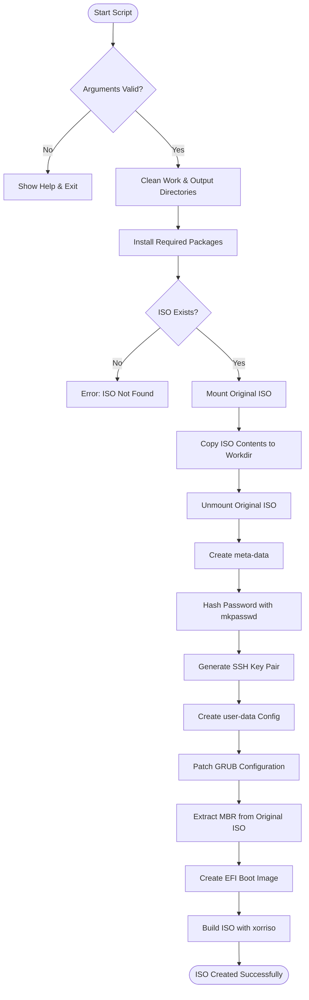
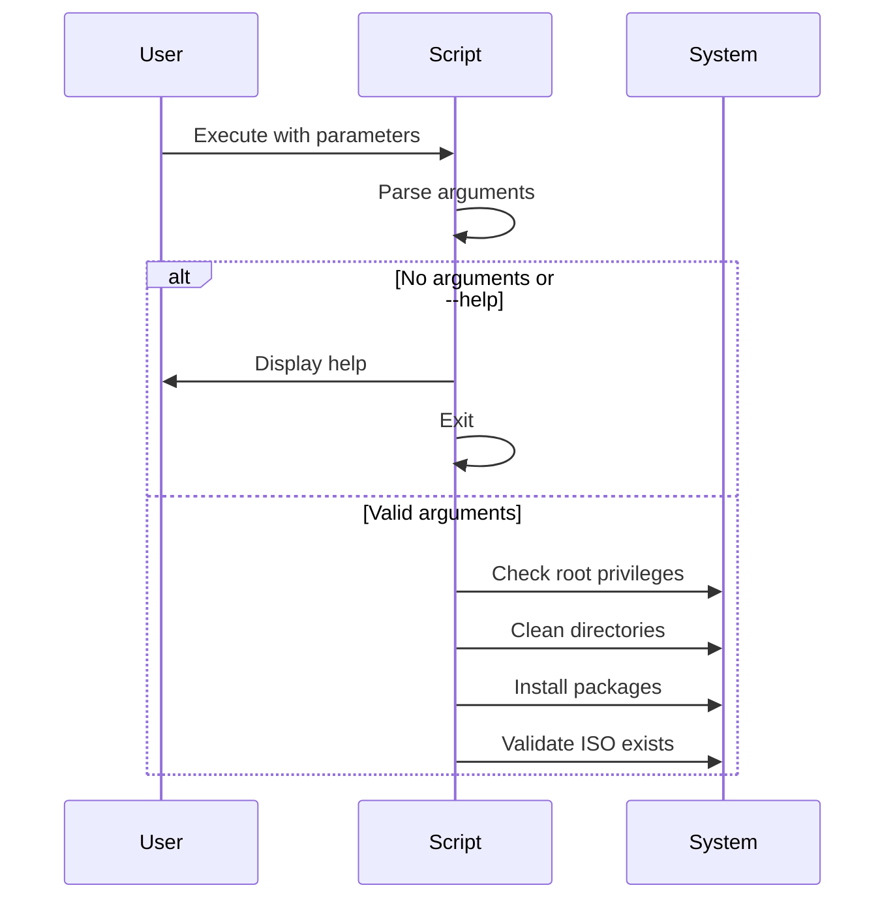
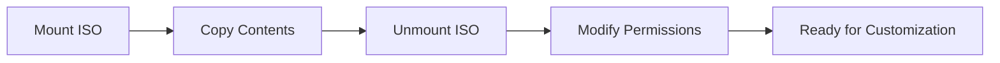
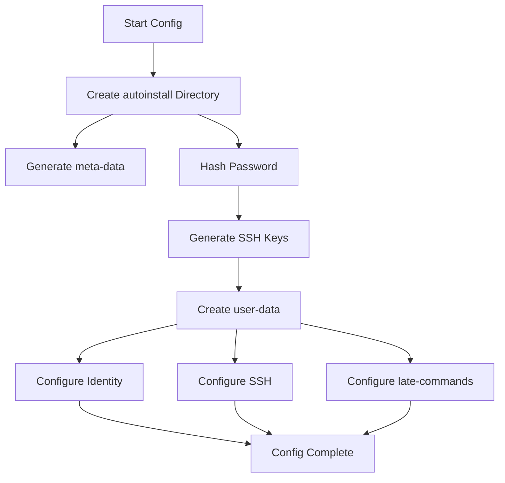
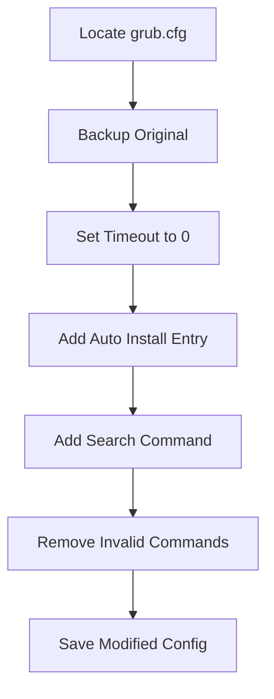
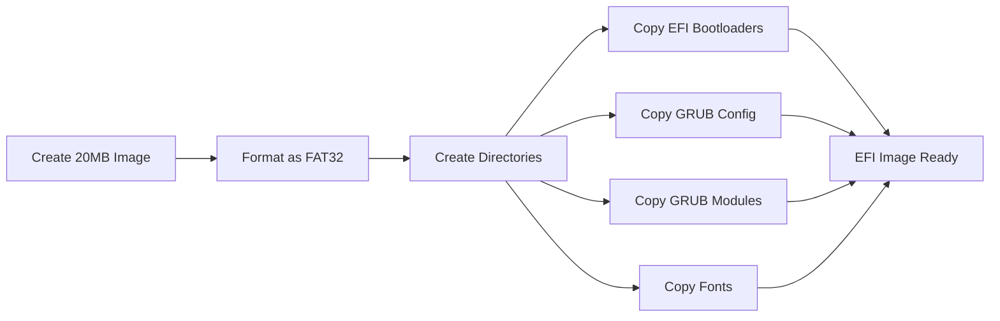
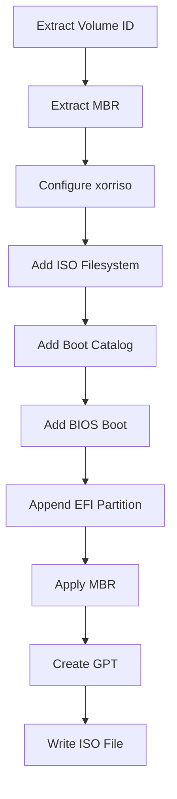
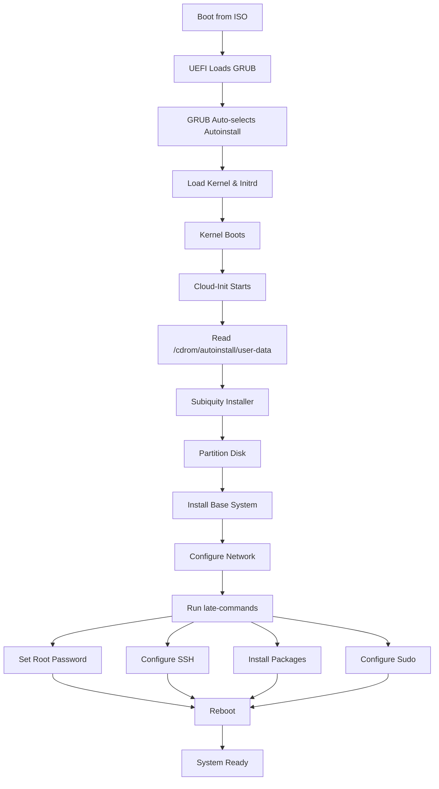
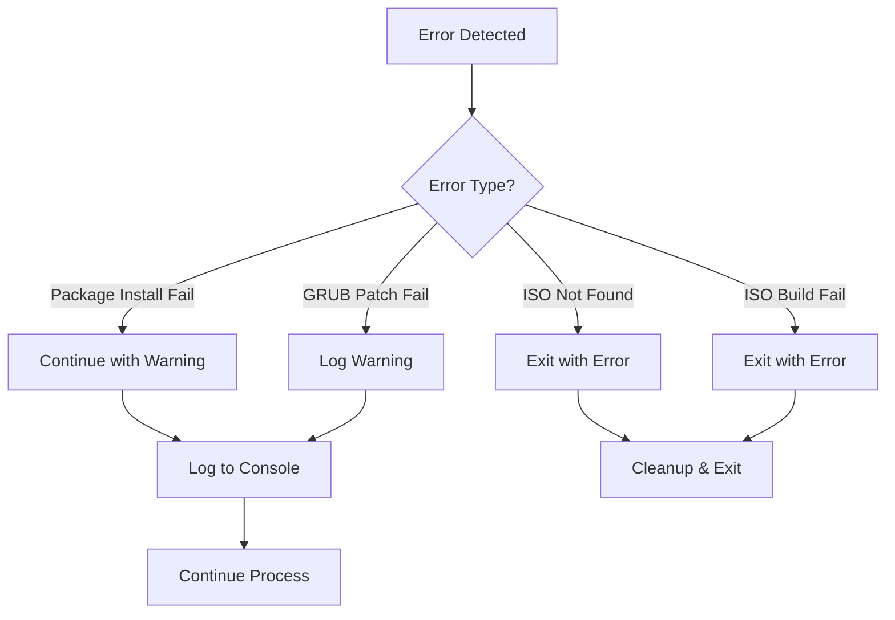
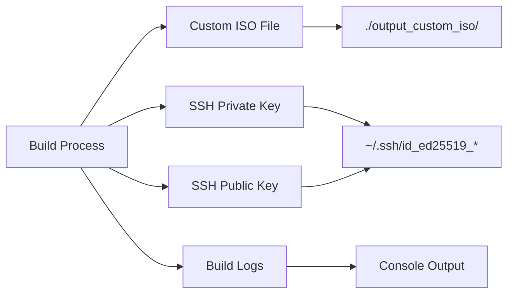

# Ubuntu Autoinstall ISO Builder - Workflow

## Build Process Flow

## Detailed Step-by-Step Workflow

### Phase 1: Initialization & Validation

**Steps:**
1. Parse command-line arguments (ISO path, username, password)
2. Validate ISO file exists
3. Clean previous build artifacts
4. Install required packages: `whois`, `genisoimage`, `xorriso`, `isolinux`, `mtools`

### Phase 2: ISO Extraction & Preparation

**Steps:**
1. Create mount point: `/mnt/ubuntuiso`
2. Mount original ISO read-only
3. Copy all contents to `./workdir_custom_iso/`
4. Unmount original ISO
5. Make workdir writable

### Phase 3: Autoinstall Configuration

**Steps:**
1. Create `./workdir_custom_iso/autoinstall/` directory
2. Generate `meta-data` with instance ID and hostname
3. Hash password using `mkpasswd -m sha-512`
4. Generate ED25519 SSH key pair
5. Create `user-data` with:
   - Autoinstall version
   - User identity (hostname, username, password)
   - Locale and keyboard settings
   - SSH configuration
   - Late-commands for post-install setup

### Phase 4: GRUB Configuration

**Steps:**
1. Locate `boot/grub/grub.cfg`
2. Create backup: `grub.cfg.orig`
3. Set GRUB timeout to 0 (auto-boot)
4. Replace "Try or Install" entry with "Auto Install" entry
5. Add `search --no-floppy --set=root --file /casper/vmlinuz`
6. Remove standalone `grub_platform` command
7. Save modified configuration

### Phase 5: EFI Boot Image Creation

**Steps:**
1. Create 20MB empty file: `/tmp/efi.img`
2. Format as FAT32 filesystem
3. Create directory structure:
   - `/EFI/boot/`
   - `/boot/grub/`
4. Copy bootloaders: `bootx64.efi`, `grubx64.efi`, `mmx64.efi`
5. Copy `grub.cfg` to EFI partition
6. Copy GRUB modules: `x86_64-efi/`
7. Copy fonts directory

### Phase 6: ISO Building

**Steps:**
1. Extract volume ID from original ISO
2. Extract MBR from original ISO (432 bytes)
3. Use `xorriso` with parameters:
   - `-r`: Rock Ridge extensions
   - `-V`: Volume ID
   - `-J -l`: Joliet extensions
   - `-b boot/grub/i386-pc/eltorito.img`: BIOS boot image
   - `-c boot.catalog`: Boot catalog
   - `-e --interval:appended_partition_2:all::`: UEFI boot from appended partition
   - `-append_partition 2 0xEF`: Append EFI partition
   - `--grub2-mbr`: Apply GRUB2 MBR
   - `-partition_offset 16`: Partition alignment
   - `-appended_part_as_gpt`: Create GPT partition table
4. Write output ISO to `./output_custom_iso/<name>_autoinstall.iso`

## Installation Workflow (Runtime)

## Error Handling Flow

## Output Artifacts

