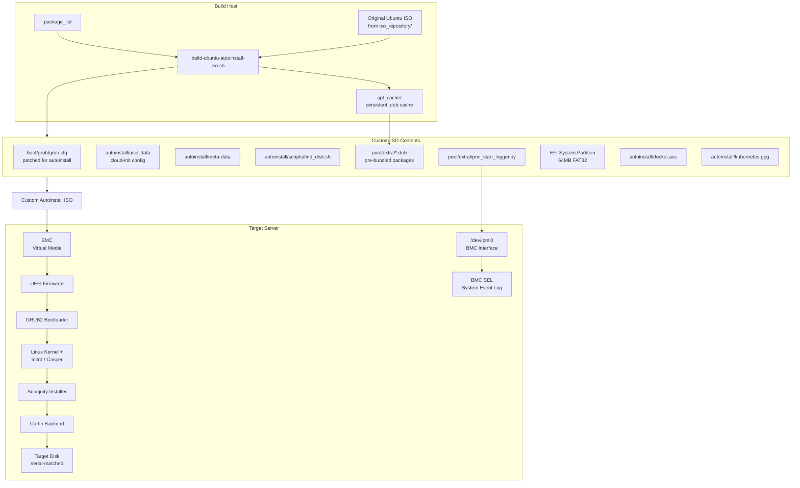
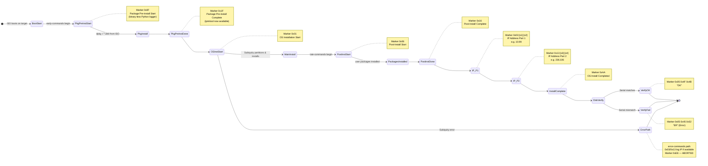
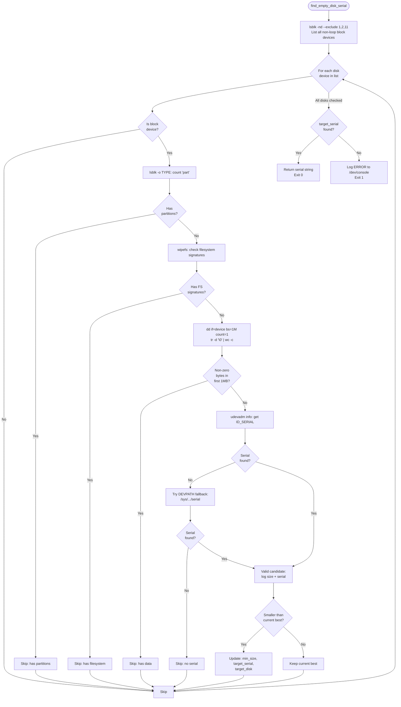
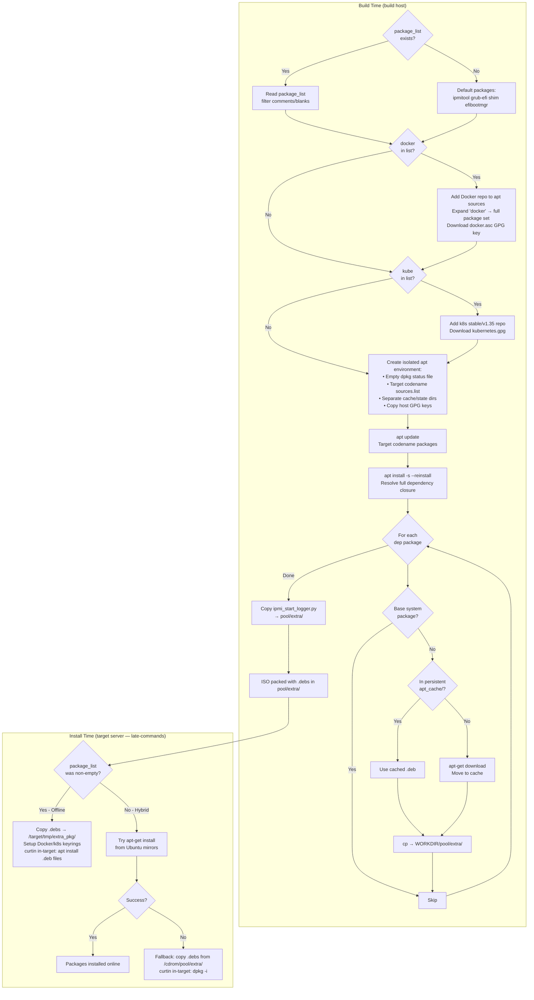
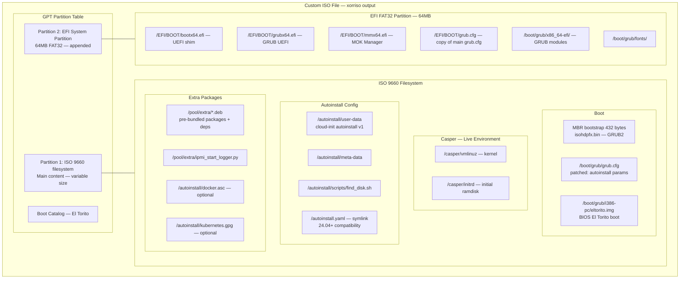

# Autoinstall System — Mermaid Charts

---

## 1. System Architecture Overview

---

## 2. Build Script — Step-by-Step Flow

```mermaid
flowchart TD
    START(["Start: build-ubuntu-autoinstall-iso.sh<br/>OS_NAME  USERNAME  PASSWORD"]) --> CHK_PKGS

    CHK_PKGS{Running as root?} -->|Yes| INST_PKGS["apt install:<br/>whois xorriso genisoimage<br/>isolinux mtools jq"]
    CHK_PKGS -->|No / --skip-install| SKIP_INST[Skip tool installation]
    INST_PKGS --> LOOKUP
    SKIP_INST --> LOOKUP

    LOOKUP["jq: lookup ISO path<br/>from iso_repository/file_list.json"] --> VER_CHK

    VER_CHK{Ubuntu 18.04?} -->|Yes| SET_1804["IS_1804=true<br/>Use preseed automation"]
    VER_CHK -->|No| SET_MODERN["IS_1804=false<br/>Use cloud-init autoinstall"]

    SET_1804 --> BUILD_ID
    SET_MODERN --> BUILD_ID

    BUILD_ID["Generate unique BUILD_ID<br/>WORKDIR + OUT_ISO_DIR"] --> MOUNT_ISO

    MOUNT_ISO["Mount original ISO<br/>→ loop mount /mnt/ubuntuiso"] --> RSYNC
    RSYNC["rsync ISO contents<br/>to WORKDIR/"] --> UMOUNT
    UMOUNT["umount /mnt/ubuntuiso"] --> PKG_DL_CHK

    PKG_DL_CHK{IS_1804?} -->|Yes| GEN_KEYS
    PKG_DL_CHK -->|No| CODENAME

    CODENAME["Detect Ubuntu codename<br/>jammy / noble / oracular..."] --> DL_PKGS

    DL_PKGS["download_extra_packages:<br/>• Isolated apt environment<br/>• Resolve full dep closure<br/>• Delta download vs cache<br/>• Copy .debs → pool/extra/"] --> DL_DOCKER

    DL_DOCKER{docker in<br/>package_list?} -->|Yes| ADD_DOCKER["Add Docker repo<br/>Bundle docker.asc GPG key"]
    DL_DOCKER -->|No| DL_K8S
    ADD_DOCKER --> DL_K8S

    DL_K8S{kube in<br/>package_list?} -->|Yes| ADD_K8S["Add k8s repo<br/>Bundle kubernetes.gpg"]
    DL_K8S -->|No| COPY_LOGGER
    ADD_K8S --> COPY_LOGGER

    COPY_LOGGER["Copy ipmi_start_logger.py<br/>→ pool/extra/"] --> GEN_KEYS

    GEN_KEYS["ssh-keygen -t ed25519<br/>Generate unique key pair"] --> HASH_PW
    HASH_PW["mkpasswd -m sha-512<br/>Hash PASSWORD"] --> GEN_CONFIG

    GEN_CONFIG["Write autoinstall/meta-data"] --> GEN_USERDATA
    GEN_CONFIG --> WRITE_FIND_DISK["Write autoinstall/scripts/find_disk.sh"]

    GEN_USERDATA["Write autoinstall/user-data<br/>#cloud-config<br/>autoinstall v1"] --> SYMLINK
    SYMLINK["Create /autoinstall.yaml symlink<br/>→ /cdrom/autoinstall/user-data<br/>24.04+ compatibility"] --> 1804_PRESEED

    1804_PRESEED{IS_1804?} -->|Yes| PRESEED["Write preseed.cfg<br/>d-i debian-installer config"] --> PATCH_GRUB
    1804_PRESEED -->|No| PATCH_GRUB

    PATCH_GRUB["Patch boot/grub/grub.cfg<br/>via Python regex:<br/>• Set timeout=5<br/>• Replace menuentry with autoinstall params<br/>• ds=nocloud;s=/cdrom/autoinstall/"] --> PATCH_ISOLINUX

    PATCH_ISOLINUX["Patch isolinux/txt.cfg<br/>isolinux/adtxt.cfg<br/>for BIOS boot"] --> REPACK

    REPACK{IS_1804?} -->|Yes| XORRISO_1804["xorriso 18.04 legacy:<br/>• isohybrid-mbr<br/>• BIOS + efi.img<br/>• No EFI partition mod"]
    REPACK -->|No| BUILD_EFI

    BUILD_EFI["Create 64MB EFI FAT image:<br/>• mmd EFI/BOOT boot/grub<br/>• mcopy bootx64.efi grubx64.efi<br/>• mcopy grub.cfg + modules"] --> XORRISO_MODERN

    XORRISO_MODERN["xorriso 20.04+:<br/>• GPT + MBR hybrid<br/>• append_partition 2 EFI<br/>• BIOS eltorito<br/>• UEFI EFI partition"] --> DONE

    XORRISO_1804 --> DONE
    DONE([Output: output_custom_iso/BUILD_ID/*.iso])
```

---

## 3. Target Boot & Installation Flow

```mermaid
sequenceDiagram
    autonumber
    participant BMC as BMC<br/>Virtual Media
    participant UEFI as UEFI / BIOS<br/>Firmware
    participant GRUB as GRUB2<br/>Bootloader
    participant K as Linux Kernel<br/>+ Casper initrd
    participant CI as Cloud-Init<br/>/ Subiquity
    participant EC as early-commands
    participant LC as late-commands
    participant IPMI as /dev/ipmi0<br/>BMC SEL
    participant DISK as Target Disk

    BMC->>UEFI: Mount ISO as virtual CD
    UEFI->>GRUB: Load EFI/BOOT/bootx64.efi → grubx64.efi
    Note over GRUB: Reads patched grub.cfg<br/>menuentry "Auto Install Ubuntu Server"
    GRUB->>K: Load /casper/vmlinuz + initrd<br/>params: autoinstall ds=nocloud&#59;s=/cdrom/autoinstall/
    K->>CI: Boot, hand off to cloud-init/subiquity

    Note over CI: Reads /cdrom/autoinstall/user-data<br/>version: 1 autoinstall config

    CI->>EC: Run early-commands

    EC->>EC: Source find_disk.sh<br/>find_empty_disk_serial()
    Note over EC: Scans all block devices:<br/>1. Partition check<br/>2. Filesystem signature check<br/>3. First 1MB data check<br/>4. Prefer smallest empty disk
    EC->>EC: sed -i replace __ID_SERIAL__<br/>in /autoinstall.yaml + runtime configs

    EC->>IPMI: modprobe ipmi_devintf/si/msghandler
    EC->>IPMI: 0x0F — Package Pre-install Start
    EC->>EC: dpkg -i /cdrom/pool/extra/*.deb
    EC->>IPMI: 0x1F — Package Pre-install Complete
    EC->>IPMI: 0x01 — OS Install Start

    CI->>CI: Subiquity runs partitioning<br/>GPT: 512MB EFI + remaining ext4<br/>matched by disk serial
    CI->>DISK: Format + mount /target
    CI->>CI: Install base system (debootstrap/curtin)

    CI->>LC: Run late-commands
    LC->>IPMI: 0x06 — Post-Install Start
    LC->>LC: chpasswd root<br/>PermitRootLogin yes<br/>PasswordAuthentication yes<br/>sudoers setup
    LC->>LC: cp resolv.conf → /target/etc/

    alt package_list provided (offline mode)
        LC->>LC: Copy .debs → /target/tmp/extra_pkg/<br/>Setup Docker/k8s keyrings if needed
        LC->>DISK: curtin in-target: apt install /tmp/extra_pkg/*.deb
    else no package_list (hybrid mode)
        LC->>LC: Try: apt-get install vim curl ipmitool htop
        alt Internet success
            LC->>DISK: Install from Ubuntu mirrors
        else Internet failure
            LC->>LC: Fallback: copy .debs from /cdrom/pool/extra/
            LC->>DISK: dpkg -i /tmp/extra_pkg/*.deb
        end
    end

    LC->>IPMI: 0x16 — Post-Install Complete
    LC->>LC: hostname -I → parse octets<br/>awk -F. eval o1 o2 o3 o4
    LC->>IPMI: 0x03 [octet1] [octet2] — IP Part 1
    LC->>IPMI: 0x13 [octet3] [octet4] — IP Part 2
    LC->>IPMI: 0xAA — OS Install Completed

    LC->>LC: Disk serial audit:<br/>lsblk → udevadm → compare __ID_SERIAL__
    alt Serial matches
        LC->>IPMI: 0x05 0x4F 0x4B — Verify OK
    else Serial mismatch
        LC->>IPMI: 0x05 0x45 0x52 — Verify ER (Error)
    end

    LC->>DISK: Copy ipmi_telemetry.log → /target/var/log/
    LC->>DISK: Copy install_disk_audit.log → /target/var/log/
    CI->>BMC: Signal reboot
```

---

## 4. IPMI SEL Telemetry Markers

---

## 5. Disk Detection Algorithm (find_disk.sh)

---

## 6. Package Bundling — Offline vs Hybrid

---

## 7. ISO Structure (20.04+ GPT Layout)

