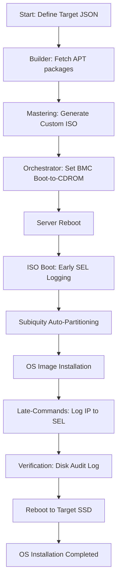

# OS Auto Deployment: Architecture & Workflow

**Version**: 1.0
**Project**: os_auto_deployment

---

## 1. High-Level Architecture
The system is divided into three functional tiers that work together to achieve zero-touch OS deployment.

### Tier 1: Orchestration (Python)
- **Location**: `/src/os_deployment/main.py`
- **Role**: Remote server management.
- **Key Actions**:
    - Connects to the target BMC via IPMI.
    - Sets the boot target (Virtual Media / CD-ROM).
    - Triggers hard/warm reboots.
    - Monitors the server lifecycle during the deployment window.

### Tier 2: Builder (Bash)
- **Location**: `/autoinstall/build-ubuntu-autoinstall-iso.sh`
- **Role**: Custom ISO mastering.
- **Key Actions**:
    - **Isolation**: Creates a temporary apt environment to fetch dependencies for the *target* OS version (not the builder's version).
    - **Bundling**: Downloads `ipmitool`, `docker`, `kubernetes`, etc., into a local `pool/extra` directory.
    - **Injection**: Embeds the `autoinstall.yaml` and custom scripts into the ISO's initrd.
    - **Auditing**: Automatically updates the YAML storage section with the target server's specific disk serial number.

### Tier 3: Deployment (Subiquity / Cloud-Init)
- **Location**: Target Hardware (Runtime)
- **Role**: Execution of the installation.
- **Key Actions**:
    - **Early Actions**: Load IPMI modules and log "Installation Starting" to the BMC SEL.
    - **Late Actions**: Capture the assigned network IP, log it to the SEL, and verify the installation disk serial before the final reboot.

---

## 2. Deployment Flow Diagram

---

## 3. Detailed Data Flow

### 1. Mastering Phase (Host Side)
The `build-ubuntu-autoinstall-iso.sh` script takes an original Ubuntu Server ISO and applies a "Live Patch":
1.  Downloads all packages specified in `autoinstall/package_list` (including dependencies) into `autoinstall/apt_cache/`.
2.  Populates `/pool/extra/` on the ISO with these `.deb` files.
3.  Modifies the `autoinstall.yaml` to include the specific `__ID_SERIAL__` of the target disk.
4.  Generates the final ISO using `xorriso`.

### 2. Initialization Phase (Pre-Install)
When the target server boots from the custom ISO:
- **IPMI Modules**: The `early-commands` enable the `ipmi_si` and `ipmi_devintf` drivers.
- **SEL Progress**: A RAW IPMI command (`0x01 0x00 0x00`) is sent to the BMC to signal the start of deployment to anyone monitoring the OOB network.

### 3. Verification Phase (Post-Install)
Before the server reboots into the new OS:
- **Network Capture**: The script captures the first `hostname -I` IP and logs it as a two-part hex entry in the SEL.
- **Integrity Check**: The `late-command` audits the disk serial number. It writes a report to `/var/log/install_disk_audit.log` on the target SSD and sends a success (`0x4f 0x4b`) or error (`0x45 0x52`) flag to the BMC.

---

## 4. Key Directories
| Path | Description |
|---|---|
| `/src/` | Python orchestration source code |
| `/autoinstall/` | ISO mastering scripts and YAML templates |
| `/autoinstall/doc/` | Technical design docs and command references |
| `/autoinstall/apt_cache/` | Persistent `.deb` repository used to speed up builds |
| `/iso_repository/` | Storage for both original and custom generated ISOs |
| `/doc/` | High-level system architecture and user guides |
