# OS Auto Deployment - Architecture Diagrams

**Document Version:** 1.0
**Last Updated:** 2026-03-30
**Diagrams:** Mermaid.js

---

## Table of Contents

1. [High-Level System Architecture](#high-level-system-architecture)
2. [Deployment Workflow](#deployment-workflow)
3. [ISO Build Pipeline](#iso-build-pipeline)
4. [Component Interaction](#component-interaction)
5. [Network Architecture](#network-architecture)
6. [IPMI Forensic Flow](#ipmi-forensic-flow)
7. [State Machine Diagram](#state-machine-diagram)
8. [Class Diagram](#class-diagram)
9. [Data Flow Diagram](#data-flow-diagram)

---

## High-Level System Architecture

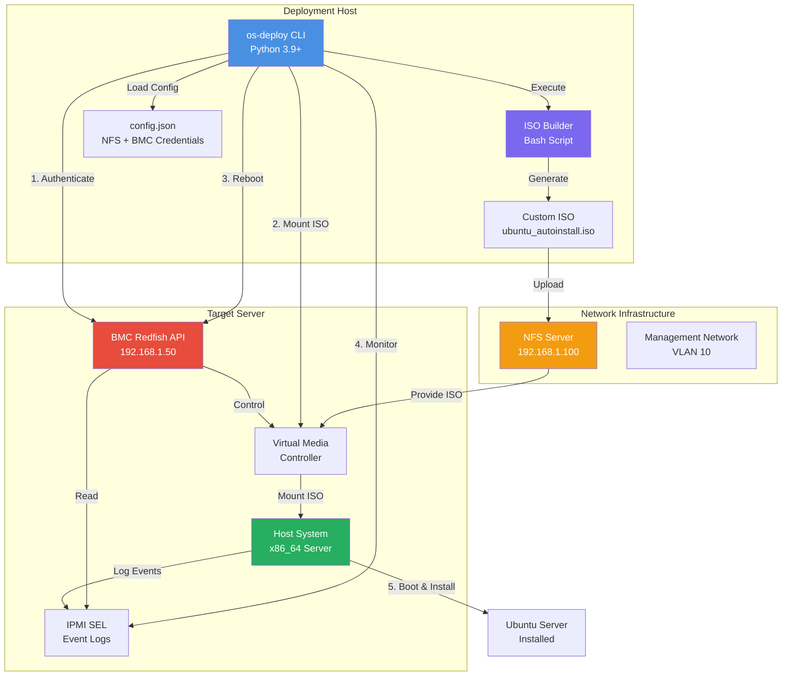

---

## Deployment Workflow

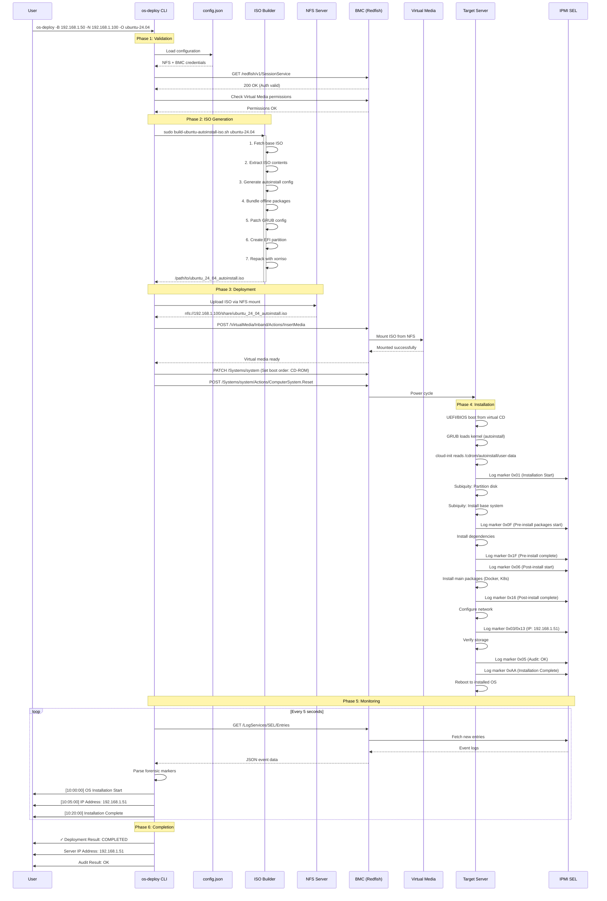

---

## ISO Build Pipeline

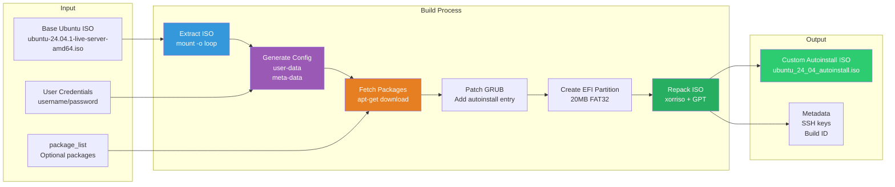

### Detailed ISO Structure

```mermaid
graph TB
    MBR[MBR<br/>GRUB2 Bootloader<br/>432 bytes]
    GPT[GPT Partition Table]

    subgraph Part1["Partition 1: ISO 9660"]
        Casper[/casper/<br/>vmlinuz<br/>initrd]
        BootGRUB[/boot/grub/<br/>grub.cfg]
        Autoinstall[/autoinstall/<br/>user-data<br/>meta-data]
        PoolExtra[/pool/extra/<br/>*.deb packages<br/>Docker, K8s, tools]
    end

    subgraph Part2["Partition 2: EFI System - 20MB"]
        EFIBoot[/EFI/boot/<br/>bootx64.efi<br/>grubx64.efi]
        EFIModules[/boot/grub/<br/>x86_64-efi/<br/>fonts/]
    end

    subgraph Part3["Partition 3: Boot Catalog"]
        ElTorito[El Torito<br/>Boot Catalog<br/>300KB]
    end

    MBR --> GPT
    GPT --> Part1
    GPT --> Part2
    GPT --> Part3

    style MBR fill:#e74c3c,color:#fff
    style GPT fill:#3498db,color:#fff
    style Autoinstall fill:#f39c12,color:#000
    style PoolExtra fill:#9b59b6,color:#fff
    style EFIBoot fill:#27ae60,color:#fff
```

---

## Component Interaction

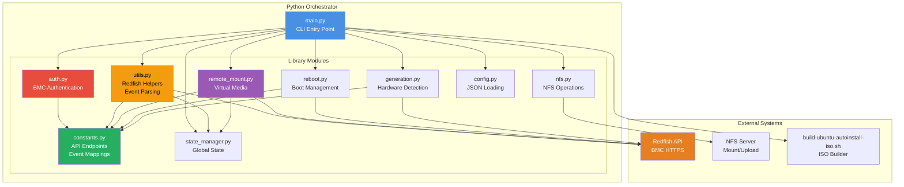

---

## Network Architecture

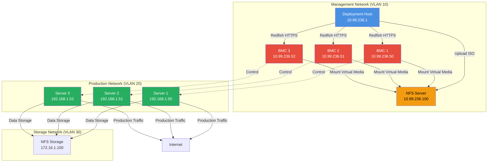

---

## IPMI Forensic Flow

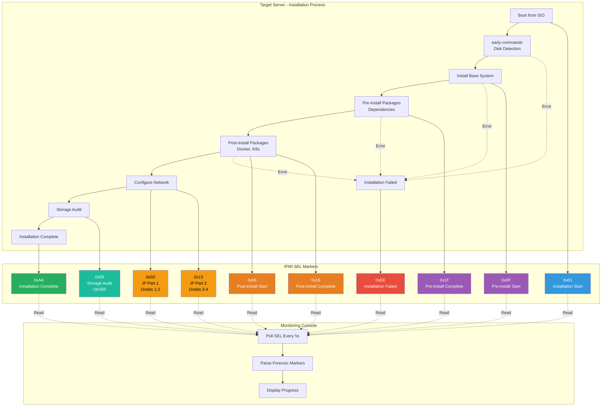

### IPMI Marker Timeline

```mermaid
gantt
    title Installation Timeline with IPMI Markers
    dateFormat HH:mm
    axisFormat %H:%M

    section Boot
    Server Boot           :done, boot, 10:00, 1m
    0x01 Start           :milestone, m01, 10:01, 0m

    section Base Install
    Disk Partitioning    :done, part, 10:01, 2m
    Base System Install  :done, base, 10:03, 5m

    section Pre-install
    0x0F Pre-start       :milestone, m0f, 10:08, 0m
    Dependencies Install :done, deps, 10:08, 3m
    0x1F Pre-complete    :milestone, m1f, 10:11, 0m

    section Post-install
    0x06 Post-start      :milestone, m06, 10:11, 0m
    Docker Install       :done, docker, 10:11, 4m
    Kubernetes Install   :done, k8s, 10:15, 5m
    0x16 Post-complete   :milestone, m16, 10:20, 0m

    section Network
    Network Config       :done, net, 10:20, 2m
    0x03 IP Part1        :milestone, m03, 10:22, 0m
    0x13 IP Part2        :milestone, m13, 10:22, 0m

    section Finalize
    Storage Audit        :done, audit, 10:22, 1m
    0x05 Audit Result    :milestone, m05, 10:23, 0m
    Final Cleanup        :done, clean, 10:23, 2m
    0xAA Complete        :milestone, maa, 10:25, 0m
    Reboot               :done, reboot, 10:25, 1m
```

---

## State Machine Diagram

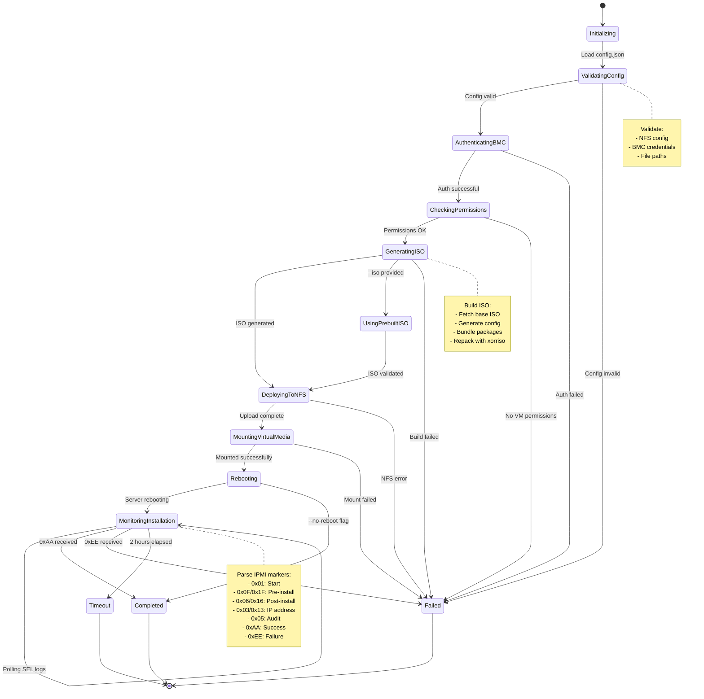

---

## Class Diagram

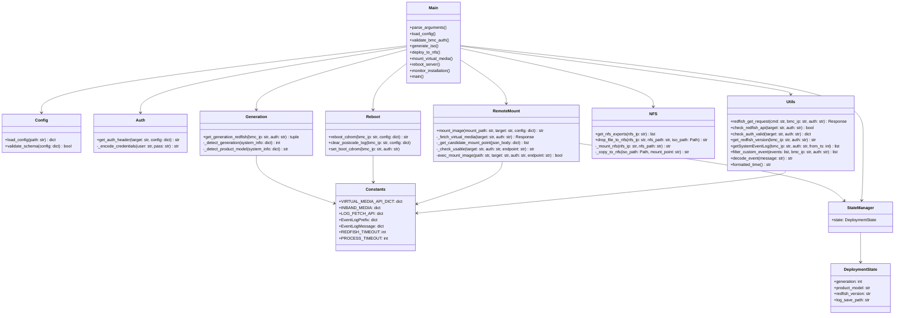

---

## Data Flow Diagram

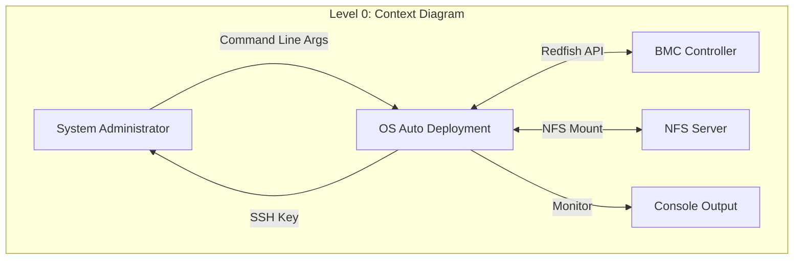

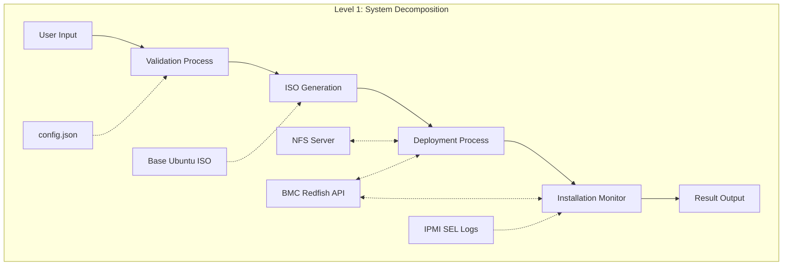

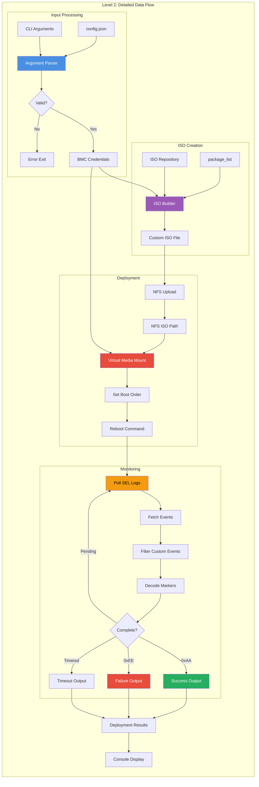

---

## Hardware Generation Support

```mermaid
graph TB
    Detect[get_generation_redfish]
    Check{Redfish Version}
    Gen6[Generation 6<br/>EGS Platform]
    Gen7[Generation 7<br/>BHS Platform]

    Detect --> Check
    Check -->|"< 1.17.0"| Gen6
    Check -->|">= 1.17.0"| Gen7

    subgraph Gen6Config["Gen-6 Configuration"]
        API6[API Endpoints]
        VM6[/redfish/v1/Managers/bmc/<br/>VirtualMedia/Internal/]
        LOG6[/redfish/v1/Systems/system/<br/>LogServices/EventLog/Entries]
        PREFIX6[EventLogPrefix:<br/>0000020000000021000412006F]

        API6 --> VM6
        API6 --> LOG6
        API6 --> PREFIX6
    end

    subgraph Gen7Config["Gen-7 Configuration"]
        API7[API Endpoints]
        VM7[/redfish/v1/Managers/bmc/<br/>VirtualMedia/Inband/]
        LOG7[/redfish/v1/Managers/bmc/<br/>LogServices/SEL/Entries]
        PREFIX7[EventLogPrefix:<br/>210012006F]
        ADDITIONAL[AdditionalDataURI<br/>External forensic data]

        API7 --> VM7
        API7 --> LOG7
        API7 --> PREFIX7
        API7 --> ADDITIONAL
    end

    subgraph CommonOps["Common Operations"]
        Mount[Mount Virtual Media]
        Monitor[Monitor Installation]
        Parse[Parse IPMI Markers]
    end

    Gen6 --> Gen6Config
    Gen7 --> Gen7Config
    Gen6 --> CommonOps
    Gen7 --> CommonOps

    style Gen6 fill:#3498db,color:#fff
    style Gen7 fill:#9b59b6,color:#fff
    style Mount fill:#27ae60,color:#fff
    style Monitor fill:#f39c12,color:#000
    style Parse fill:#e67e22,color:#fff
```

---

## Error Handling Flow

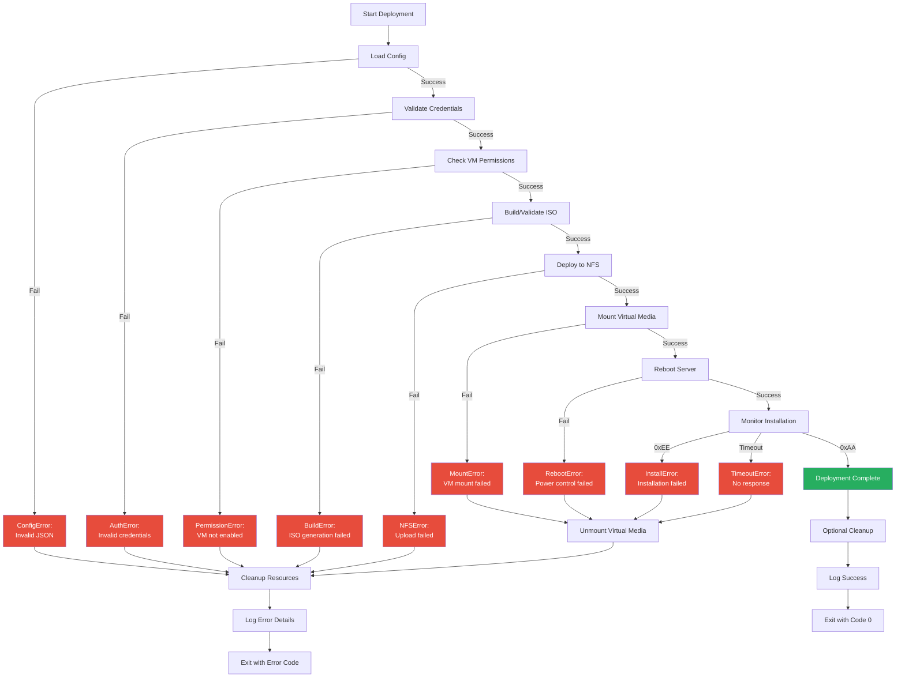

---

## Deployment Patterns

### Single Server Deployment

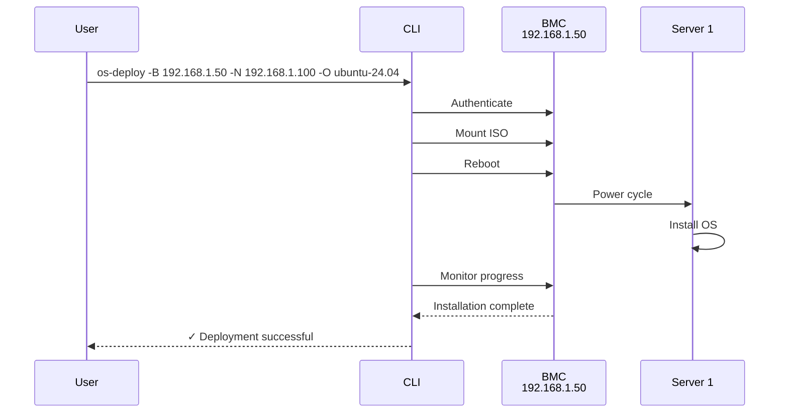

### Parallel Deployment (Roadmap)

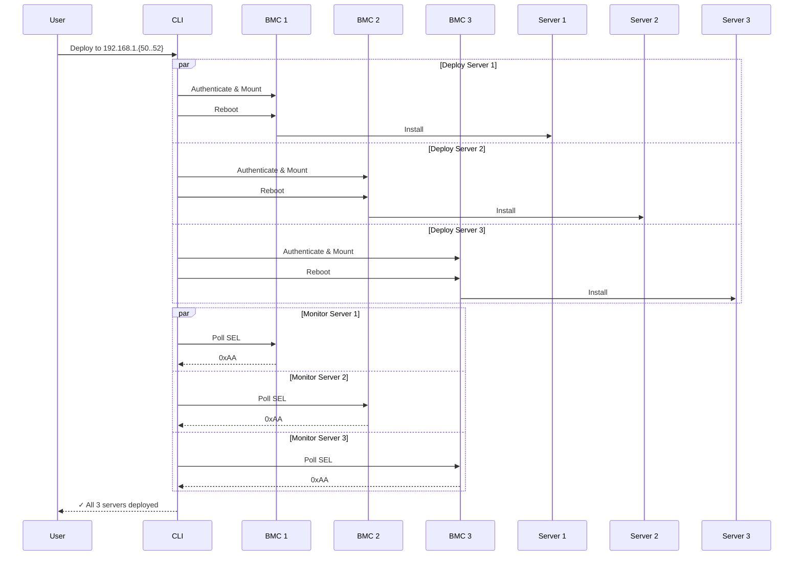

---

## Summary

These diagrams provide a comprehensive visual representation of the OS Auto Deployment system architecture:

1. **High-Level Architecture** - Overall system components and relationships
2. **Deployment Workflow** - Complete sequence from user command to installed OS
3. **ISO Build Pipeline** - Custom ISO creation process
4. **Component Interaction** - Python module dependencies
5. **Network Architecture** - Multi-VLAN network topology
6. **IPMI Forensic Flow** - Installation monitoring with markers
7. **State Machine** - Deployment state transitions
8. **Class Diagram** - Code structure and relationships
9. **Data Flow** - Information flow through the system

These diagrams can be rendered in any Mermaid-compatible viewer or documentation platform.

---

**Document Information:**
- **Version:** 1.0
- **Last Updated:** 2026-03-30
- **Diagram Format:** Mermaid.js
- **License:** Copyright © 2025-2026 MiTAC Computing Technology Corporation
