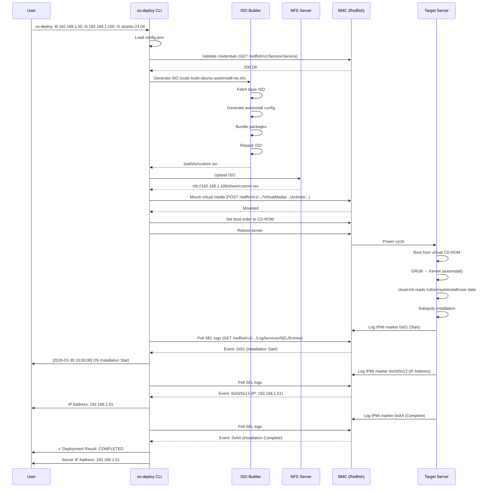

# OS Auto Deployment System - Introduction

**Document Version:** 1.0
**Last Updated:** 2026-03-30
**Author:** MiTAC Computing Technology Corporation
**Maintained By:** Claude Code Documentation

---

## Table of Contents

1. [What is OS Auto Deployment?](#what-is-os-auto-deployment)
2. [Why Use This Tool?](#why-use-this-tool)
3. [Key Features](#key-features)
4. [Quick Start](#quick-start)
5. [How It Works](#how-it-works)
6. [Architecture Overview](#architecture-overview)
7. [Use Cases](#use-cases)
8. [System Requirements](#system-requirements)
9. [Getting Help](#getting-help)
10. [Project Structure](#project-structure)

---

## What is OS Auto Deployment?

**OS Auto Deployment** is an enterprise-grade automation tool designed to deploy Ubuntu Server operating systems to bare-metal servers **without any manual intervention**. It leverages BMC (Baseboard Management Controller) technology, specifically Redfish API and IPMI, to perform fully automated OS installations over virtual media.

### The Problem It Solves

Traditional server OS installation requires:
- 🕐 Manual interaction with installation wizards
- 💿 Physical media (USB drives, DVDs) or manual ISO mounting
- 👤 On-site presence or remote KVM access
- ⏱️ Hours of repetitive work for cluster deployments
- 📝 Manual configuration of each server

### The Solution

OS Auto Deployment eliminates all manual steps:
- ✅ **Zero-touch deployment** - Boot to fully configured server
- ✅ **Remote operation** - No physical access required
- ✅ **Batch deployment** - Deploy entire clusters simultaneously
- ✅ **Consistent configuration** - Identical setup every time
- ✅ **Real-time monitoring** - Track installation progress via IPMI telemetry

---

## Why Use This Tool?

### For System Administrators

**Save Time:**
- Deploy 10 servers in the time it takes to deploy 1 manually
- No more babysitting installation wizards
- Automated post-installation configuration

**Reduce Errors:**
- Eliminate typos and configuration mistakes
- Consistent, repeatable deployments
- Pre-validated configurations

**Increase Visibility:**
- Real-time installation progress tracking
- IPMI SEL markers for forensic analysis
- Deployment history and audit logs

### For DevOps Engineers

**Infrastructure as Code:**
- Declarative configuration via JSON
- Version-controlled deployment parameters
- Reproducible infrastructure

**CI/CD Integration:**
- Scriptable API for automation pipelines
- Parallel deployment support (roadmap)
- Integration with orchestration tools

**Cloud-Native Ready:**
- Pre-bundled Docker and Kubernetes support
- Offline installation capability for air-gapped environments
- Container-ready base images

### For Data Centers

**Scalability:**
- Deploy entire racks without human intervention
- Centralized ISO management via NFS
- Support for multiple hardware generations

**Cost Efficiency:**
- Reduce deployment time from hours to minutes
- Lower operational costs through automation
- Minimize human error and rework

**Compliance:**
- Consistent security baselines
- Audit-ready deployment logs
- Forensic telemetry for troubleshooting

---

## Key Features

### 🚀 Automated Installation

- **Zero-touch deployment** from power-on to login prompt
- **cloud-init** autoinstall with Ubuntu Subiquity
- **Pre-configured users** with SSH key authentication
- **Automatic partitioning** with customizable disk layouts

### 🔧 Hardware Support

- **Multi-generation BMC support** (Gen-6 EGS, Gen-7 BHS)
- **Redfish API integration** for modern BMC management
- **IPMI SEL logging** for installation telemetry
- **Hybrid UEFI/BIOS boot** with GPT partition tables

### 📦 Package Management

- **Offline installation support** with bundled packages
- **Intelligent fallback** (internet → local cache)
- **Docker & Kubernetes** pre-bundled (v1.35)
- **Custom package lists** via `package_list` file

### 📊 Monitoring & Forensics

- **Real-time progress tracking** via IPMI markers
- **Installation phase monitoring:**
  - 0x01 - OS Installation Start
  - 0x0F/0x1F - Package Pre-install
  - 0x06/0x16 - Post-Install Phase
  - 0x03/0x13 - IP Address Logging
  - 0x05 - Storage Verification
  - 0xAA - Installation Complete
  - 0xEE - Installation Failed
- **IP address capture** and reporting
- **Storage audit** (OK/ER verification)

### 🔒 Security Features

- **SSH key-based authentication** (ED25519)
- **Redfish API over HTTPS**
- **Root access control**
- **Sudo configuration**
- **Password hashing** (bcrypt)

### 🌐 Network Integration

- **NFS-based ISO distribution**
- **Virtual media mounting** via BMC
- **Network configuration** during installation
- **DNS and gateway setup**

---

## Quick Start

### Prerequisites

```bash
# System Requirements
- Ubuntu 20.04/22.04/24.04 host
- Python 3.9+
- Root privileges (for ISO operations)
- Network access to BMC and NFS server

# Install Poetry
curl -sSL https://install.python-poetry.org | python3 -

# Install system dependencies
sudo apt-get update
sudo apt-get install -y whois genisoimage xorriso isolinux mtools jq sshpass
```

### Installation

```bash
# Clone the repository
cd /path/to/os_auto_deployment

# Install Python dependencies
poetry install

# Configure NFS and BMC credentials
cp config.json.template config.json
# Edit config.json with your settings
```

### First Deployment

```bash
# Basic deployment with default credentials
poetry run os-deploy \
  -B 192.168.1.50 \
  -N 192.168.1.100 \
  -O ubuntu-24.04.1-live-server-amd64

# With custom credentials
poetry run os-deploy \
  -B 192.168.1.50 \
  -BU admin \
  -BP password123 \
  -N 192.168.1.100 \
  -O ubuntu-24.04.1-live-server-amd64 \
  -OU myuser \
  -OP mypassword

# Using pre-built ISO
poetry run os-deploy \
  -B 192.168.1.50 \
  -N 192.168.1.100 \
  --iso /path/to/custom.iso
```

### What Happens Next?

1. **Validation** (10 seconds)
   - BMC authentication check
   - NFS server connectivity
   - Virtual media permissions

2. **ISO Generation** (2-5 minutes)
   - Download base Ubuntu ISO (if needed)
   - Bundle offline packages
   - Create autoinstall configuration
   - Repack ISO with xorriso

3. **Deployment** (30 seconds)
   - Upload ISO to NFS server
   - Mount ISO via BMC virtual media
   - Set boot order to CD-ROM

4. **Installation** (10-30 minutes)
   - Server reboots to ISO
   - Automated Ubuntu installation
   - Package installation
   - Post-configuration scripts
   - Final reboot

5. **Monitoring** (real-time)
   - Console shows IPMI markers
   - IP address reported when available
   - Installation complete notification

---

## How It Works

### The Deployment Workflow

```
┌─────────────────────────────────────────────────────────────────┐
│ 1. Preparation Phase                                            │
├─────────────────────────────────────────────────────────────────┤
│ • Load configuration (config.json)                              │
│ • Validate BMC credentials                                      │
│ • Check virtual media permissions                               │
└─────────────────────────────────────────────────────────────────┘
                              ↓
┌─────────────────────────────────────────────────────────────────┐
│ 2. ISO Generation Phase                                         │
├─────────────────────────────────────────────────────────────────┤
│ • Fetch base Ubuntu ISO from repository                         │
│ • Extract ISO contents                                          │
│ • Generate cloud-init autoinstall config                        │
│   - user-data (installation configuration)                      │
│   - meta-data (instance metadata)                               │
│ • Bundle offline packages (Docker, K8s, tools)                  │
│ • Patch GRUB configuration                                      │
│ • Create EFI boot partition (20MB)                              │
│ • Repack ISO with xorriso (hybrid UEFI/BIOS)                    │
└─────────────────────────────────────────────────────────────────┘
                              ↓
┌─────────────────────────────────────────────────────────────────┐
│ 3. Deployment Phase                                             │
├─────────────────────────────────────────────────────────────────┤
│ • Upload custom ISO to NFS server                               │
│ • Mount ISO via BMC Redfish API                                 │
│ • Configure boot order (CD-ROM first)                           │
│ • Clear PostCode logs (Gen-7)                                   │
│ • Reboot server                                                 │
└─────────────────────────────────────────────────────────────────┘
                              ↓
┌─────────────────────────────────────────────────────────────────┐
│ 4. Installation Phase (on target server)                        │
├─────────────────────────────────────────────────────────────────┤
│ • UEFI/BIOS boots to virtual CD-ROM                             │
│ • GRUB loads kernel with autoinstall parameter                  │
│ • cloud-init reads /cdrom/autoinstall/user-data                 │
│ • Subiquity performs automated installation:                    │
│   - Disk partitioning (GPT)                                     │
│   - Install base system                                         │
│   - Configure network                                           │
│   - Install packages (online or offline fallback)               │
│   - Run late-commands (user creation, SSH, etc.)                │
│ • IPMI markers logged to BMC SEL                                │
│ • Server reboots to installed OS                                │
└─────────────────────────────────────────────────────────────────┘
                              ↓
┌─────────────────────────────────────────────────────────────────┐
│ 5. Monitoring Phase                                             │
├─────────────────────────────────────────────────────────────────┤
│ • Poll BMC SEL logs every 5 seconds                             │
│ • Parse IPMI forensic markers:                                  │
│   ✓ 0x01 - Installation started                                 │
│   ✓ 0x0F - Pre-install packages started                         │
│   ✓ 0x1F - Pre-install packages complete                        │
│   ✓ 0x06 - Post-install started                                 │
│   ✓ 0x16 - Post-install complete                                │
│   ✓ 0x03/0x13 - IP address captured                             │
│   ✓ 0x05 - Storage verification (OK/ER)                         │
│   ✓ 0xAA - Installation complete                                │
│   ✗ 0xEE - Installation failed                                  │
│ • Display progress to console                                   │
│ • Timeout after 2 hours if no completion                        │
└─────────────────────────────────────────────────────────────────┘
                              ↓
┌─────────────────────────────────────────────────────────────────┐
│ 6. Completion Phase                                             │
├─────────────────────────────────────────────────────────────────┤
│ • Report final status (Success/Failed/Timeout)                  │
│ • Display deployed server IP address                            │
│ • Show storage audit result                                     │
│ • Clean up virtual media (optional)                             │
│ • Save logs to ./collected_log/                                 │
└─────────────────────────────────────────────────────────────────┘
```

### Key Technologies

| Component | Technology | Purpose |
|-----------|-----------|---------|
| **Orchestration** | Python 3.9+ | Main deployment logic |
| **ISO Building** | Bash + xorriso | Custom ISO creation |
| **BMC Control** | Redfish API | Remote server management |
| **Telemetry** | IPMI SEL | Installation progress tracking |
| **Automation** | cloud-init | Unattended installation |
| **Installer** | Ubuntu Subiquity | OS installation engine |
| **Boot** | GRUB2 | Hybrid UEFI/BIOS bootloader |
| **Storage** | NFS | Centralized ISO distribution |
| **Packages** | APT + .deb | Offline package bundling |

---

## Architecture Overview

### System Components

```
┌────────────────────────────────────────────────────────────────┐
│                    Deployment Host                             │
├────────────────────────────────────────────────────────────────┤
│                                                                │
│  ┌──────────────────────────────────────────────────────┐    │
│  │ os-deploy (Python CLI)                               │    │
│  ├──────────────────────────────────────────────────────┤    │
│  │ • main.py - Orchestration                            │    │
│  │ • lib/utils.py - Redfish helpers                     │    │
│  │ • lib/auth.py - Authentication                       │    │
│  │ • lib/remote_mount.py - Virtual media                │    │
│  │ • lib/reboot.py - Boot management                    │    │
│  │ • lib/nfs.py - NFS operations                        │    │
│  │ • lib/generation.py - Hardware detection             │    │
│  └──────────────────────────────────────────────────────┘    │
│                          ↓                                     │
│  ┌──────────────────────────────────────────────────────┐    │
│  │ build-ubuntu-autoinstall-iso.sh (Bash)               │    │
│  ├──────────────────────────────────────────────────────┤    │
│  │ • Fetch base Ubuntu ISO                              │    │
│  │ • Generate autoinstall config                        │    │
│  │ • Bundle offline packages                            │    │
│  │ • Create hybrid UEFI/BIOS ISO                        │    │
│  └──────────────────────────────────────────────────────┘    │
│                          ↓                                     │
│  ┌──────────────────────────────────────────────────────┐    │
│  │ Custom Autoinstall ISO                               │    │
│  │ (ubuntu_XX_XX_autoinstall.iso)                       │    │
│  └──────────────────────────────────────────────────────┘    │
│                                                                │
└────────────────────────────────────────────────────────────────┘
                              ↓
                         (NFS Upload)
                              ↓
┌────────────────────────────────────────────────────────────────┐
│                      NFS Server                                │
├────────────────────────────────────────────────────────────────┤
│  /nfs/share/                                                   │
│  └── ubuntu_XX_XX_autoinstall.iso                             │
└────────────────────────────────────────────────────────────────┘
                              ↓
                    (Redfish Virtual Media Mount)
                              ↓
┌────────────────────────────────────────────────────────────────┐
│                   Target Server (BMC)                          │
├────────────────────────────────────────────────────────────────┤
│                                                                │
│  ┌──────────────────────────────────────────────────────┐    │
│  │ BMC (Baseboard Management Controller)                │    │
│  ├──────────────────────────────────────────────────────┤    │
│  │ • Redfish API (HTTPS)                                │    │
│  │ • Virtual Media Controller                           │    │
│  │ • IPMI SEL (System Event Log)                        │    │
│  │ • Boot Order Management                              │    │
│  └──────────────────────────────────────────────────────┘    │
│                          ↓                                     │
│  ┌──────────────────────────────────────────────────────┐    │
│  │ Host System                                          │    │
│  ├──────────────────────────────────────────────────────┤    │
│  │ 1. Boot from virtual CD-ROM                          │    │
│  │ 2. GRUB → Kernel → cloud-init                        │    │
│  │ 3. Subiquity automated installation                  │    │
│  │ 4. IPMI markers → BMC SEL                            │    │
│  │ 5. Reboot to installed Ubuntu                        │    │
│  └──────────────────────────────────────────────────────┘    │
│                                                                │
└────────────────────────────────────────────────────────────────┘
```

### Data Flow



---

## Use Cases

### 1. Data Center Provisioning

**Scenario:** Deploy Ubuntu to 50 new servers in a rack

```bash
# Generate reusable ISO once
./autoinstall/build-ubuntu-autoinstall-iso.sh ubuntu-24.04.1-live-server-amd64

# Deploy to all servers (sequential or parallel)
for ip in 192.168.1.{50..99}; do
    os-deploy -B $ip -N 192.168.1.100 --iso /path/to/custom.iso &
done
wait

# Result: Entire rack provisioned in ~30 minutes
```

**Benefits:**
- Consistent configuration across all servers
- No manual intervention required
- Parallel deployment capability

### 2. Lab Environment Setup

**Scenario:** Quickly rebuild test servers for QA

```bash
# Deploy with custom credentials
os-deploy \
  -B 192.168.10.50 \
  -N 192.168.10.100 \
  -O ubuntu-22.04.3-live-server-amd64 \
  -OU testuser \
  -OP testpass123

# Result: Fresh Ubuntu install in 15 minutes
```

**Benefits:**
- Rapid iteration on test environments
- Reproducible test configurations
- Easy rollback to clean state

### 3. Air-Gapped Environment

**Scenario:** Deploy to servers without internet access

```bash
# 1. Create package_list with required packages
cat > autoinstall/package_list <<EOF
vim
htop
docker-ce
kubelet
kubeadm
kubectl
EOF

# 2. Build ISO (will bundle all packages)
./autoinstall/build-ubuntu-autoinstall-iso.sh ubuntu-24.04.1-live-server-amd64

# 3. Deploy (installation uses bundled .debs)
os-deploy -B 192.168.1.50 -N 192.168.1.100 --iso /path/to/custom.iso
```

**Benefits:**
- Fully offline installation
- No external dependencies
- Compliance with air-gap requirements

### 4. Kubernetes Cluster Bootstrap

**Scenario:** Deploy 3 control plane + 5 worker nodes

```bash
# Generate K8s-ready ISO (Docker + K8s pre-bundled)
./autoinstall/build-ubuntu-autoinstall-iso.sh ubuntu-24.04.1-live-server-amd64

# Deploy control plane nodes
for ip in 192.168.1.{50..52}; do
    os-deploy -B $ip -N 192.168.1.100 --iso /path/to/custom.iso
done

# Deploy worker nodes
for ip in 192.168.1.{60..64}; do
    os-deploy -B $ip -N 192.168.1.100 --iso /path/to/custom.iso
done

# Result: K8s cluster nodes ready for kubeadm init/join
```

**Benefits:**
- Pre-configured container runtime
- Consistent Kubernetes versions
- Fast cluster provisioning

### 5. Disaster Recovery

**Scenario:** Rebuild failed server to last known good state

```bash
# Use pre-built ISO from backup
os-deploy \
  -B 192.168.1.50 \
  -N 192.168.1.100 \
  --iso /backup/isos/production_baseline_v3.iso

# Result: Server restored to baseline in 20 minutes
```

**Benefits:**
- Rapid recovery from hardware failures
- Consistent with production baseline
- Minimal downtime

---

## System Requirements

### Deployment Host

**Operating System:**
- Ubuntu 20.04 LTS or later
- Debian 11 or later
- Any Linux distribution with bash 4.0+

**Hardware:**
- CPU: 2+ cores
- RAM: 4GB minimum, 8GB recommended
- Disk: 20GB free space (for ISO caching)
- Network: Gigabit Ethernet recommended

**Software:**
```bash
# Required
- Python 3.9 or later
- Poetry (Python dependency manager)
- bash 4.0+
- xorriso (ISO creation)
- genisoimage
- mtools
- jq
- sshpass (for remote SSH commands)

# Optional (for development)
- git
- shellcheck
- pytest
```

### Target Servers

**Hardware:**
- BMC with Redfish API support (Gen-6 or Gen-7)
- UEFI or BIOS boot support
- Network connectivity to NFS server
- Minimum 2GB RAM
- Minimum 20GB disk space

**BMC Requirements:**
- Redfish API version 1.0+ (Gen-6) or 1.17+ (Gen-7)
- Virtual media support (WebISO mounting)
- IPMI 2.0 for SEL logging
- Inband and Outband virtual media enabled

### Network Infrastructure

**NFS Server:**
- NFS v3 or v4
- Export path accessible from target servers
- Sufficient storage for ISO files (~2-3GB per ISO)
- Network bandwidth: 100Mbps minimum

**Network Requirements:**
- BMC network: Management VLAN
- NFS network: Storage VLAN or management VLAN
- Target server network: Production VLAN (configured during installation)

---

## Getting Help

### Documentation

- **[Project Review](./project_review.md)** - Comprehensive code review and recommendations
- **[Architecture](../../autoinstall/doc/01_architecture.md)** - System design and components
- **[Workflow](../../autoinstall/doc/02_workflow.md)** - Build and installation processes
- **[Debugging Guide](../../autoinstall/doc/04_debugging_guide.md)** - Troubleshooting common issues
- **[Change Log](../../autoinstall/doc/change_log.md)** - Detailed version history

### Common Commands

```bash
# Show help
os-deploy --help

# Show version
os-deploy --version

# Validate config without deploying
python -m os_deployment.lib.config config.json

# Build ISO only (no deployment)
./autoinstall/build-ubuntu-autoinstall-iso.sh ubuntu-24.04.1-live-server-amd64

# Deploy without reboot (manual testing)
os-deploy -B 192.168.1.50 -N 192.168.1.100 -O ubuntu-24.04 --no-reboot

# Use pre-built ISO
os-deploy -B 192.168.1.50 -N 192.168.1.100 --iso /path/to/custom.iso
```

### Troubleshooting

**Installation hangs or fails:**
1. Check BMC connectivity: `curl -k https://192.168.1.50/redfish/v1`
2. Verify virtual media permissions in BMC web UI
3. Review logs on target server:
   - `/var/log/installer/subiquity-server-debug.log`
   - `/var/log/cloud-init.log`
   - `/var/log/ipmi_telemetry.log`
4. Check IPMI SEL for forensic markers: `ipmitool sel list`

**ISO generation fails:**
1. Verify internet connectivity (for package downloads)
2. Check disk space: `df -h`
3. Review build script output
4. Verify xorriso installation: `xorriso --version`

**BMC authentication errors:**
1. Verify credentials in config.json
2. Test manual login to BMC web UI
3. Check Redfish API access: `curl -k -u admin:password https://192.168.1.50/redfish/v1/SessionService`

### Contact & Support

- **Issues:** Report bugs and request features (internal issue tracker)
- **Email:** Contact your system administrator or DevOps team
- **Documentation:** See [autoinstall/doc/](../../autoinstall/doc/) for detailed guides

---

## Project Structure

```
os_auto_deployment/
├── README.md                       # Project overview
├── pyproject.toml                  # Python dependencies and metadata
├── poetry.lock                     # Locked dependency versions
├── config.json.template            # Configuration template
├── config.json                     # Your configuration (NFS, BMC credentials)
│
├── src/                            # Python source code
│   └── os_deployment/
│       ├── main.py                 # CLI entry point and orchestration
│       ├── _version.py             # Version information
│       └── lib/                    # Library modules
│           ├── auth.py             # BMC authentication
│           ├── config.py           # Configuration loading
│           ├── constants.py        # Generation-aware constants
│           ├── utils.py            # Redfish helpers and event parsing
│           ├── remote_mount.py     # Virtual media management
│           ├── reboot.py           # Boot management
│           ├── nfs.py              # NFS operations
│           ├── generation.py       # Hardware detection
│           ├── state_manager.py    # Global state management
│           └── ...
│
├── autoinstall/                    # ISO building scripts
│   ├── build-ubuntu-autoinstall-iso.sh  # Main build script (1133 lines)
│   ├── package_list                # Optional: packages to bundle
│   ├── iso_repository/             # Downloaded base ISOs
│   ├── output_custom_iso/          # Generated custom ISOs
│   ├── workdir_custom_iso/         # Build artifacts (temporary)
│   ├── apt_cache/                  # Cached .deb packages
│   ├── ipmi_start_logger.py        # Binary-less IPMI logging
│   └── doc/                        # Autoinstall documentation
│       ├── README.md               # Documentation index
│       ├── 01_architecture.md      # System architecture
│       ├── 02_workflow.md          # Build and install workflows
│       ├── 03_development_progress.md  # Project timeline
│       ├── 04_debugging_guide.md   # Troubleshooting guide
│       ├── 05-15_*.md              # Ubuntu version-specific fixes
│       ├── 16_apt_cache_mechanism_design.md  # Offline packages
│       ├── 17_sel_logging_commands.md  # IPMI marker documentation
│       └── change_log.md           # Detailed version history
│
├── doc/                            # Additional documentation
│   └── claude/                     # Claude Code generated docs
│       ├── introduction.md         # This document
│       └── project_review.md       # Comprehensive code review
│
├── tests/                          # Test suite (TODO: Add tests)
│   └── __init__.py
│
├── collected_log/                  # Deployment logs (per BMC/timestamp)
├── main_change_log.md              # Python orchestrator changelog
├── main_debug_note.md              # Debug notes and forensic analysis
└── .gitignore                      # Git ignore patterns
```

---

## Next Steps

Now that you understand what OS Auto Deployment is and how it works, here are suggested next steps:

### For First-Time Users:

1. **Setup:** Follow the [Quick Start](#quick-start) guide to install dependencies
2. **Configuration:** Copy `config.json.template` to `config.json` and configure your NFS/BMC
3. **Test Deployment:** Deploy to a single test server
4. **Review Logs:** Examine `/var/log/installer/` on the target server to understand the process
5. **Scale Up:** Deploy to multiple servers once comfortable

### For Developers:

1. **Read Architecture:** Study [01_architecture.md](../../autoinstall/doc/01_architecture.md) for system design
2. **Review Code:** Examine [main.py](../../src/os_deployment/main.py) and library modules
3. **Check Issues:** Read [project_review.md](./project_review.md) for improvement opportunities
4. **Contribute:** See testing, security, and refactoring recommendations

### For Administrators:

1. **Plan Deployment:** Identify servers for automated deployment
2. **Configure NFS:** Set up centralized ISO storage
3. **Test Network:** Verify BMC and NFS connectivity
4. **Create Baselines:** Build standard ISOs for different server roles
5. **Document Process:** Create runbooks for your environment

---

## Conclusion

OS Auto Deployment transforms manual, error-prone server provisioning into a fast, consistent, and reliable automated process. Whether you're deploying a single lab server or an entire data center rack, this tool provides the automation, visibility, and repeatability needed for modern infrastructure management.

**Key Takeaways:**

- ✅ **Zero-touch deployment** eliminates manual steps
- ✅ **Multi-generation hardware support** (Gen-6 and Gen-7)
- ✅ **Real-time monitoring** via IPMI forensic markers
- ✅ **Offline installation** for air-gapped environments
- ✅ **Docker/K8s ready** with pre-bundled packages
- ✅ **Production-proven** with comprehensive documentation

Ready to get started? Jump to the [Quick Start](#quick-start) section!

---

**Document Information:**
- **Version:** 1.0
- **Last Updated:** 2026-03-30
- **Maintained By:** MiTAC Computing Technology Corporation
- **License:** Copyright © 2025-2026 MiTAC Computing Technology Corporation. All rights reserved.
