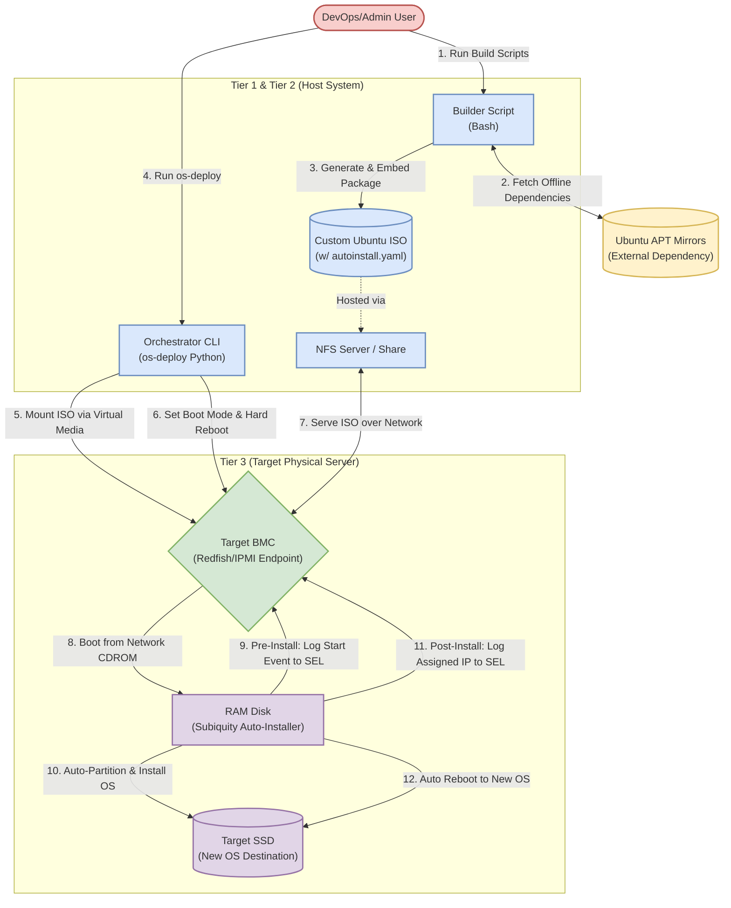

# OS Auto Deployment - Architecture Diagram (Draw.io Compatible)

The following diagram represents the core architecture and workflow of the OS Auto Deployment tool. 

It is provided using **Mermaid JS**, which is fully supported and natively editable in **Draw.io**.

### How to use this in Draw.io / Diagrams.net:
1. Open up [Draw.io / Diagrams.net](https://app.diagrams.net/).
2. In the top toolbar, go to **Arrange** > **Insert** > **Advanced** > **Mermaid...** (or click the `+` icon in the toolbar > **Advanced** > **Mermaid...**).
3. Copy the plain text content from the code block below (excluding the backticks ````mermaid ````) and paste it into the dialog box.
4. Click **Insert**. Draw.io will automatically parse the code and render a fully editable, styled diagram with native shapes and routing!


