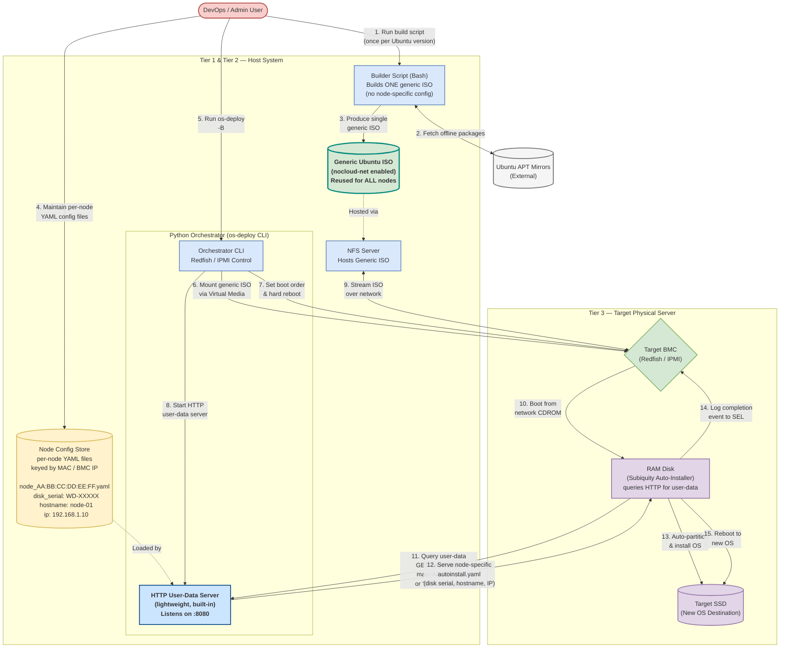

# Suggestion 1: Decouple Node Configs from ISO (Dynamic User-Data)
## Draw.io Compatible Architecture Diagram

This diagram illustrates the proposed architecture for **Suggestion 1**: replacing per-node custom ISOs with a single generic ISO + a dynamic HTTP user-data server hosted in the Python Orchestration tier.

### Key Changes vs. Current Architecture

| | Current | Proposed |
|---|---|---|
| ISO | Re-built per node (embeds `autoinstall.yaml` + disk serial) | Single generic ISO, reused for all nodes |
| `autoinstall.yaml` | Baked into ISO at build time | Served dynamically over HTTP at boot time |
| Node identity | Encoded in ISO filename / build step | Resolved at runtime via MAC address or BMC IP |
| Config store | Implicit (one ISO = one config) | Explicit YAML inventory files per node |

---

### How to Import into Draw.io

1. Open [Draw.io / Diagrams.net](https://app.diagrams.net/).
2. In the toolbar, click **Extras** > **Edit Diagram** (or `+` > **Advanced** > **Mermaid...**).
3. Copy the Mermaid code block below (excluding the triple backticks) and paste it into the dialog.
4. Click **OK** / **Insert** to render.

---

---

### Architecture Notes

- **Steps 1–3** only need to run once per Ubuntu release — the same generic ISO is reused for every node in the cluster.
- **Step 4** is the only per-node preparation: a small YAML file with `disk_serial`, `hostname`, `ip`, etc., keyed by MAC address or BMC IP.
- **Steps 11–12** are the core of the proposal: Subiquity's `nocloud-net` data source fetches `user-data` from the HTTP server at boot time. The server identifies the node by its MAC address or BMC IP from the HTTP request and returns the correct `autoinstall.yaml`.
- The HTTP user-data server runs inside the existing Python Orchestrator process — no new infrastructure is required.
