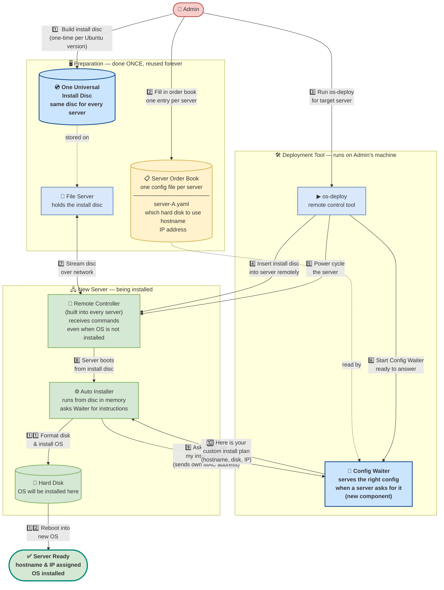

# Suggestion 1: Dynamic User-Data — Easy Read Version
## Draw.io Compatible Diagram

> **Analogy:** Think of this like a **restaurant kitchen**.
> - The **generic ISO** is a blank meal kit — the same box shipped to every table.
> - The **per-node YAML config** is the customer's order slip — unique per table.
> - The **HTTP User-Data Server** is the waiter who reads the order slip and tells the kitchen exactly how to prepare the meal.
> - Without this proposal, the kitchen had to pre-pack a custom box for every single table before service even started.

---

### How to Import into Draw.io

1. Open [app.diagrams.net](https://app.diagrams.net/)
2. Click **Extras** > **Edit Diagram**
3. Paste the Mermaid code below and click **OK**

---



---

### What Each Part Does (Plain Language)

| Component | What it is | Plain English |
|---|---|---|
| **One Universal Install Disc** | Generic Ubuntu ISO | Like a blank USB stick with Ubuntu — same one used for every server |
| **File Server** | NFS share | A shared folder on the network that holds the install disc |
| **Server Order Book** | Per-node YAML config files | A notebook with one page per server — what disk to use, what hostname, what IP |
| **os-deploy** | Python CLI tool | The remote control that operates the server even before an OS is installed |
| **Config Waiter** | Embedded HTTP server | Sits and waits for a server to ask "what should I do?" — answers with the right install plan |
| **Remote Controller** | BMC (IPMI/Redfish) | A tiny independent chip in every server that lets you power it on/off and insert a virtual disc remotely |
| **Auto Installer** | Ubuntu Subiquity | The install wizard that runs automatically from the disc, no human clicking needed |
| **Hard Disk** | Target SSD/HDD | Where the final OS gets written |

---

### Why This Is Better Than Before

```
BEFORE                              AFTER
──────────────────────────────      ──────────────────────────────
Build custom disc for server A      Build ONE disc  (done once)
Build custom disc for server B           │
Build custom disc for server C           │
        │                                ▼
        ▼                          Write one config file per server
Boot server A from its disc              │
Boot server B from its disc              ▼
Boot server C from its disc        Boot ALL servers from same disc
                                   Each server fetches its own plan
```

- **Before:** 10 servers = 10 ISO builds, 10 different disc files, lots of storage
- **After:** 10 servers = 1 ISO build, 10 small YAML files (each ~10 lines)
