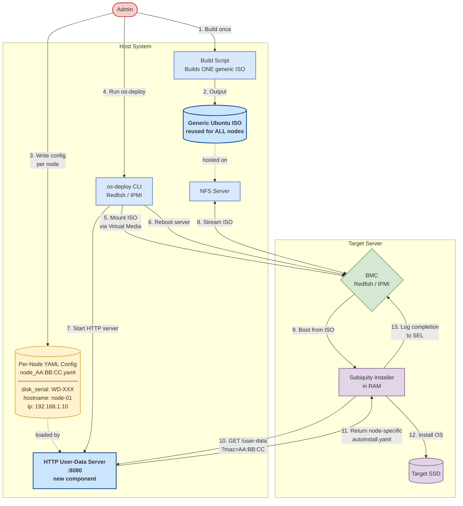

# Suggestion 1: Dynamic User-Data Architecture (Simplified)
## Draw.io Compatible Diagram

**Goal:** Use one generic ISO for all servers. Instead of baking config into the ISO, serve each node's `autoinstall.yaml` dynamically over HTTP at boot time.

### Current vs. Proposed

| | Current | Proposed |
|---|---|---|
| ISO | Rebuilt for every node | One ISO reused for all nodes |
| `autoinstall.yaml` | Embedded inside ISO | Served over HTTP at boot time |
| Node identity | Baked into ISO at build time | Looked up by MAC address at runtime |

---

### How to Import into Draw.io

1. Open [app.diagrams.net](https://app.diagrams.net/)
2. Click **Extras** > **Edit Diagram**
3. Paste the Mermaid code below and click **OK**

---

---

### Key Points

- **Step 1–2:** Run the build script once per Ubuntu version — the same ISO is used for every server.
- **Step 3:** The only per-node setup is a small YAML file (disk serial, hostname, IP), stored on the host.
- **Step 10–11:** At boot, the installer asks the HTTP server for its config using its MAC address. The HTTP server returns the correct `autoinstall.yaml` for that node.
- **No new infrastructure needed** — the HTTP server runs inside the existing `os-deploy` process.
