```mermaid
flowchart TD
    classDef phase    fill:#dae8fc,stroke:#6c8ebf,stroke-width:2px,font-weight:bold;
    classDef action   fill:#ffffff,stroke:#6c8ebf,stroke-width:1px;
    classDef decision fill:#fff2cc,stroke:#d6b656,stroke-width:2px;
    classDef success  fill:#d5e8d4,stroke:#82b366,stroke-width:2px,font-weight:bold;
    classDef error    fill:#f8cecc,stroke:#b85450,stroke-width:2px;
    classDef new      fill:#cce5ff,stroke:#004085,stroke-width:2px,font-weight:bold;

    %% ─── PHASE 0: Prerequisites ───────────────────────────────────────
    P0(["PHASE 0\nPrerequisites\n(One-time setup)"]):::phase

    P0  --> A1["Build generic Ubuntu ISO\nwith nocloud-net enabled\n(no node-specific config embedded)"]:::new
    A1  --> A2["Host generic ISO on NFS share"]:::action
    A2  --> A3["Create per-node YAML config file\nkeyed by MAC address or BMC IP\n─────────────────\ndisk_serial: WD-XXXXX\nhostname: node-01\nip: 192.168.1.10"]:::new

    %% ─── PHASE 1: Deployment Init ─────────────────────────────────────
    A3  --> P1(["PHASE 1\nDeployment Init"]):::phase

    P1  --> B1["Admin runs:\nos-deploy -B &lt;BMC_IP&gt;"]:::action
    B1  --> B2["Orchestrator loads node config\nfrom YAML store\n(lookup by BMC IP or MAC)"]:::action
    B2  --> D1{"Node config\nfound?"}:::decision
    D1  -->|No| E1["ERROR: No config for this node\nAbort deployment"]:::error
    D1  -->|Yes| B3["Orchestrator starts\nHTTP User-Data Server\non port :8080"]:::new
    B3  --> B4["Register node config\nin HTTP server memory\n(MAC → autoinstall.yaml)"]:::new

    %% ─── PHASE 2: BMC & Boot Setup ────────────────────────────────────
    B4  --> P2(["PHASE 2\nBMC & Boot Setup"]):::phase

    P2  --> C1["Redfish: Mount generic ISO\nvia Virtual Media CD1\nnfs://host/generic.iso"]:::action
    C1  --> D2{"Mount\nsuccessful?"}:::decision
    D2  -->|No| E2["ERROR: Virtual Media mount failed\nCheck NFS / Redfish connectivity"]:::error
    D2  -->|Yes| C2["Redfish: Set boot order\nto Virtual CD-ROM (once)"]:::action
    C2  --> C3["Redfish / IPMI:\nHard reboot target server"]:::action
    C3  --> C4["BMC boots server\nfrom network CDROM"]:::action

    %% ─── PHASE 3: Installer Bootstrap ─────────────────────────────────
    C4  --> P3(["PHASE 3\nInstaller Bootstrap"]):::phase

    P3  --> F1["Subiquity loads into RAM disk\nfrom generic ISO"]:::action
    F1  --> F2["Kernel reads boot params:\nds=nocloud-net\ndsmode=net\nseedfrom=http://&lt;HOST&gt;:8080/"]:::action
    F2  --> F3["Subiquity sends:\nHTTP GET /user-data?mac=AA:BB:CC:DD:EE:FF"]:::action
    F3  --> D3{"HTTP server\nfinds config\nfor this MAC?"}:::decision
    D3  -->|No| E3["ERROR: Unknown MAC address\nHTTP 404 returned\nInstaller halts"]:::error
    D3  -->|Yes| F4["HTTP server renders\nnode-specific autoinstall.yaml\ndisk_serial, hostname, ip injected"]:::new
    F4  --> F5["Subiquity receives\nHTTP 200 OK\n+ custom autoinstall.yaml"]:::action

    %% ─── PHASE 4: OS Installation ──────────────────────────────────────
    F5  --> P4(["PHASE 4\nOS Installation"]):::phase

    P4  --> G1["Subiquity validates\ntarget disk serial\nagainst config"]:::action
    G1  --> D4{"Correct disk\nfound?"}:::decision
    D4  -->|No| E4["ERROR: Disk serial mismatch\nInstaller aborts\n(prevents wrong-disk wipe)"]:::error
    D4  -->|Yes| G2["Auto-partition target SSD\nper storage layout in YAML"]:::action
    G2  --> G3["Install Ubuntu OS\n+ offline packages\nfrom ISO"]:::action
    G3  --> G4["Run early-commands\n(pre-install hooks)"]:::action
    G4  --> G5["Run late-commands\n─────────────────\nLog new host IP to BMC SEL\nLog completion event"]:::action

    %% ─── PHASE 5: Completion ───────────────────────────────────────────
    G5  --> P5(["PHASE 5\nCompletion"]):::phase

    P5  --> H1["Orchestrator polls BMC SEL\nwaiting for completion event"]:::action
    H1  --> D5{"Completion\nevent received?"}:::decision
    D5  -->|Timeout| E5["WARNING: No SEL event received\nCheck installer logs via KVM"]:::error
    D5  -->|Yes| H2["Orchestrator stops\nHTTP User-Data Server"]:::new
    H2  --> H3["Redfish: Eject Virtual Media\nSet boot order back to SSD"]:::action
    H3  --> H4["Server reboots\ninto newly installed OS"]:::action
    H4  --> H5(["SUCCESS\nNode provisioned\nHostname & IP assigned"]):::success
```

# Suggestion 1: Dynamic User-Data — Deployment Flowchart
## Draw.io Compatible

Step-by-step process flowchart for the proposed dynamic provisioning flow.
Includes decision points, error paths, and phase separations.

### How to Import into Draw.io

1. Open [Draw.io / Diagrams.net](https://app.diagrams.net/).
2. Click **Extras** > **Edit Diagram**, or `+` > **Advanced** > **Mermaid...**.
3. Paste the Mermaid code block below (excluding the triple backticks).
4. Click **OK** to render.

---

---

### Phase Summary

| Phase | Actor | Key Step |
|---|---|---|
| **0 – Prerequisites** | Admin | Build generic ISO once; write per-node YAML config |
| **1 – Deployment Init** | Orchestrator | Load node config; start HTTP user-data server |
| **2 – BMC & Boot Setup** | Orchestrator → BMC | Mount generic ISO via Virtual Media; reboot server |
| **3 – Installer Bootstrap** | Subiquity → HTTP Server | Fetch `autoinstall.yaml` dynamically via MAC lookup |
| **4 – OS Installation** | Subiquity | Validate disk; partition; install; run hooks; log to SEL |
| **5 – Completion** | Orchestrator | Detect SEL event; stop HTTP server; eject media; done |
