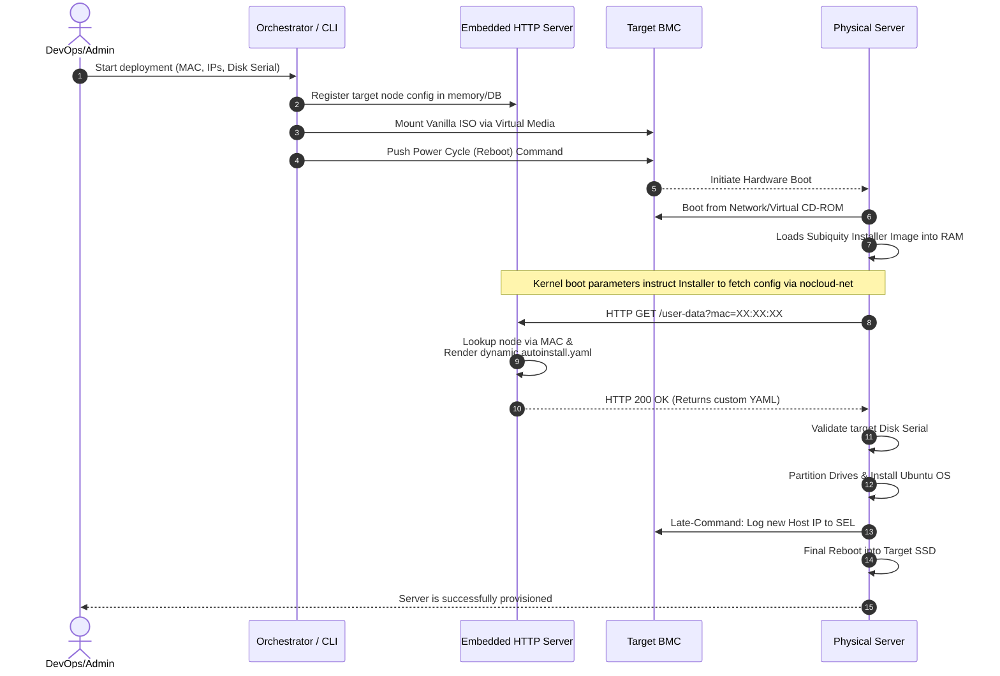

# Suggestion 1: Dynamic Provisioning Sequence Flow

This sequence chart demonstrates the timeline and interaction between the different tiers when utilizing an **embedded HTTP Server** combined with a **vanilla generic ISO** instead of having to rebuild the ISO file.

